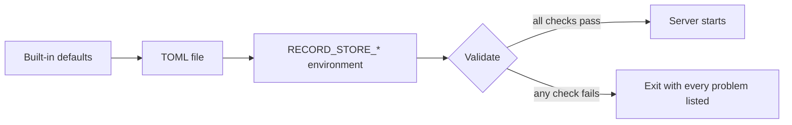

# Configuration

Record Store is configured by a TOML file, environment variables, or both. This page
covers how to structure that; the exhaustive list of settings is the
[Configuration Reference](../reference/configuration.md).

## Resolution order



Validation runs once over the fully resolved configuration. It reports every problem
it finds, not just the first, so one restart is enough to see all of them.

## Where to put what

The split that works in practice:

| | Put here | Why |
| --- | --- | --- |
| **TOML file** | Ports, paths, limits, policy, log settings | Reviewable, diffable, belongs in change control |
| **Environment** | Root credentials, master key, management tokens | Never lands in a repository or an image layer |

```bash
record-store server --config /etc/record-store/config.toml
```

The file is optional. A container deployment can run on environment variables alone.

## Validate before restarting

```bash
record-store server --config /etc/record-store/config.toml check-config
```

This loads the file, applies the current environment, validates, and exits. It writes
nothing and binds nothing. Run it in CI and before a rolling restart.

## Unknown keys are errors

Every configuration section rejects keys it does not recognise. A misspelled key stops
startup rather than being silently ignored — a setting you believed was applied but
was not is worse than a failed start.

## Required settings

The server will not start without root credentials:

```bash
RECORD_STORE_ROOT_ACCESS_KEY=<your-access-key>
RECORD_STORE_ROOT_SECRET_KEY=<your-secret-key>
```

Everything else has a default. Two more you will want early:

```bash
# Required for encryption at rest; wraps stored credentials and webhook secrets.
RECORD_STORE_CREDENTIAL_MASTER_KEY=<your-master-key>

# Required for the management API, the CLI, and the web console.
RECORD_STORE_MANAGEMENT_SYSTEM_TOKEN=<your-system-token>
```

!!! danger "The master key cannot be rotated"
    `credential_master_key` wraps stored credentials, webhook signing secrets, and —
    when `storage.encryption_enabled` is on — the per-object data keys. Replacing it
    makes everything sealed under the old key permanently unreadable. Generate it
    once, back it up separately from the data directory, and leave it alone.

## Secrets never appear in output

Secret-typed settings render as `<redacted>` in debug output, and a parse failure
names the variable without printing its value. That holds for logs and for
`check-config`.

## Generating secrets

```bash
# Root secret key: 16-256 visible ASCII characters
openssl rand -base64 32

# Master key and management tokens: 32-1024 visible ASCII characters
openssl rand -base64 48
```

Management role tokens must be distinct from one another, and the metrics scrape
token must differ from all of them. See [Authorization](../security/authorization.md).

## Changing configuration

Configuration is read at startup. There is no reload signal — apply a change by
restarting the process. A graceful shutdown drains in-flight requests within
`server.shutdown_grace_period_seconds`.

Restarting takes the service down for as long as the process is stopped. Plan a
configuration change into a maintenance window, or accept the gap. See
[Upgrading](../deployment/upgrading.md).
