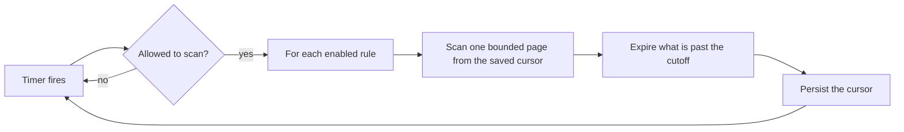

# Lifecycle Rules

A lifecycle rule expires objects on a schedule. Rules are per bucket, matched by key
prefix, and run by a background worker.

## What a rule can do

Two independent actions, and a rule needs at least one:

| Action | Applies to | Effect |
| --- | --- | --- |
| `expiration` | Current objects older than N days | Deletes the object |
| `noncurrent_version_expiration` | Non-current versions older than N days | Permanently removes that version |

`N` is whole days, between 1 and 36500.

A rule with neither action is refused. A rule that expires nothing would sit there
looking like cleanup was happening when it was not.

## Deletion semantics

The two actions behave differently, and the difference matters:

- **`expiration`** performs an ordinary delete. On a versioned bucket that writes a
  delete marker and the history is retained. On an unversioned bucket the object is
  gone.
- **`noncurrent_version_expiration`** removes a specific version permanently. It never
  touches the current version.

So on a versioned bucket, `expiration` alone reclaims no space. Pair the two to
actually shrink the bucket:


See [Versioning](../concepts/versioning.md).

## Creating a rule

```bash
curl -X POST https://management.example.com/api/v1/buckets/logs/lifecycle \
  -H "Authorization: Bearer <your-management-token>" \
  -H "Content-Type: application/json" \
  -d '{"prefix":"debug/","expiration":30,"noncurrent_version_expiration":7}'
```

| Field | Required | Default |
| --- | --- | --- |
| `prefix` | no | `""` — the whole bucket |
| `enabled` | no | `true` |
| `expiration` | one of the two | — |
| `noncurrent_version_expiration` | one of the two | — |

The response is the created rule, including its `id`.

An empty prefix matches every object in the bucket. That is legitimate for a scratch
bucket and a mistake almost everywhere else — check the prefix before creating a rule.

## Listing and updating

```bash
curl https://management.example.com/api/v1/buckets/logs/lifecycle \
  -H "Authorization: Bearer <your-management-token>"
```

Updates are **complete replacements**, addressed through the bucket:

```bash
curl -X PUT https://management.example.com/api/v1/buckets/logs/lifecycle/<rule-id> \
  -H "Authorization: Bearer <your-management-token>" \
  -H "Content-Type: application/json" \
  -d '{"prefix":"debug/","enabled":false,"expiration":7}'
```

Every field is sent. Omitting `noncurrent_version_expiration` clears it — that is
deliberate, so "remove this action" is expressible and never ambiguous with "leave it
alone".

Setting `enabled` to `false` is the safe way to stop a rule while you think about it.
The rule stays visible and its progress cursor is preserved.

## Deleting a rule

```bash
curl -X DELETE https://management.example.com/api/v1/lifecycle-rules/<rule-id> \
  -H "Authorization: Bearer <your-management-token>"
```

Deleting a rule stops future expiry. Objects already expired are not restored.

## How the worker runs



Three properties follow from this design:

- **Bounded.** Each pass scans at most `lifecycle.batch_size` entries per rule per
  action. A rule over ten million objects does not stall the deployment.
- **Restart-safe.** The cursor is durable. A restart resumes the scan; it does not
  start over.
- **Single-writer in a cluster.** An activation gate lets one node scan at a time.
  Expiring the same object from several nodes would produce duplicate delete markers
  and duplicated work.

Tuning:

```toml
[lifecycle]
interval_seconds = 3600
batch_size = 100
```

`interval_seconds` accepts 1–86400; `batch_size` accepts 1–1000.

A rule can only expire `batch_size` entries per pass. With the defaults that is 100
objects an hour — deliberately gentle. Raise `batch_size` or lower `interval_seconds`
if a backlog is not draining; do both if it is large.

## Timing is approximate

An object is expired on the first pass **after** its age crosses the cutoff, and only
when the cursor reaches it. With the default hourly interval, expect expiry within
hours of the boundary, not at the moment it is crossed. Lifecycle is a cleanup
mechanism, not a deadline enforcer.

For deletion at an exact time, delete explicitly.

## Observing it

Every expiry is written to the [audit log](audit-log.md) as
`lifecycle.expire-object` or `lifecycle.expire-noncurrent-version`, with principal
`system:lifecycle`:

```bash
record-store audit \
  --principal system:lifecycle \
  --limit 200 \
  --endpoint https://management.example.com
```

Each pass that scanned anything also logs `lifecycle scan completed` with scanned,
expired, and failure counts. A non-zero failure count means individual deletions
failed; they are retried on the next pass, and the details are in the process log.
