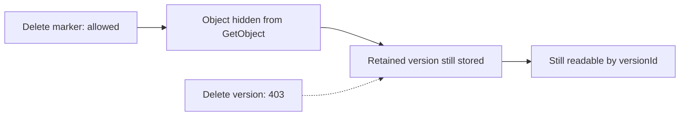

# Object Lock

Object Lock keeps an object version from being deleted, either until a date or until
somebody explicitly lifts a hold. It is what turns "we have a copy" into "we can show
this copy was not replaced."

Record Store implements AWS Object Lock semantics: two retention modes, an independent
legal hold, per-bucket defaults, and a governance bypass gated on its own permission.

## Enabling it

Object Lock is chosen when a bucket is created, and never afterwards:

```bash
aws --endpoint-url http://localhost:7600 s3api create-bucket \
  --bucket records --object-lock-enabled-for-bucket
```

This also enables versioning, because a retention protects immutable versions and there
is nothing to protect without them.

Enabling lock on an existing bucket is refused. That is deliberate and stricter than
current AWS: turning it on later would claim protection over versions that were written
without it, and Record Store will not make a promise retroactively. Copy the objects
into a new locked bucket instead.

For the same reason, versioning cannot be suspended while Object Lock is enabled:

```text
PUT /records?versioning  Status=Suspended
→ 409 InvalidBucketState
```

Suspending versioning would make the next write replace the null version in place,
which is exactly the history a retained version is meant to be safe from.

## The two modes

| | `GOVERNANCE` | `COMPLIANCE` |
| --- | --- | --- |
| Delete before the date | Only with an authorized bypass | Never, by anyone |
| Shorten the date | Only with an authorized bypass | Never, by anyone |
| Extend the date | Always allowed | Always allowed |
| Raise to `COMPLIANCE` | Allowed, no bypass needed | — |
| Root credential | Bound by it, unless it holds the bypass permission | Bound by it |

`COMPLIANCE` has no override at all. Not for the root credential, not for a management
token, not for anyone holding every policy in the deployment. If that is not what you
want, use `GOVERNANCE`.

Raising a version from `GOVERNANCE` to `COMPLIANCE` only ever takes away a way out, so
it counts as tightening and needs no bypass.

## Setting retention

At write time, with headers:

```bash
aws --endpoint-url http://localhost:7600 s3api put-object \
  --bucket records --key statement.pdf --body ./statement.pdf \
  --object-lock-mode COMPLIANCE \
  --object-lock-retain-until-date 2033-01-01T00:00:00Z
```

Or afterwards, on a specific version:

```bash
aws --endpoint-url http://localhost:7600 s3api put-object-retention \
  --bucket records --key statement.pdf --version-id <version> \
  --retention '{"Mode":"COMPLIANCE","RetainUntilDate":"2033-01-01T00:00:00Z"}'
```

Setting a lock at write time needs the same permission as setting it afterwards, on top
of `s3:PutObject`: `s3:PutObjectRetention` for `x-amz-object-lock-mode` and
`x-amz-object-lock-retain-until-date`, and `s3:PutObjectLegalHold` for
`x-amz-object-lock-legal-hold`. That applies to `PutObject`, `CopyObject`, and
`CreateMultipartUpload`, which is where a multipart upload's lock is fixed. Without the
permission the request is refused and nothing is written. A writer that names no lock
needs only `s3:PutObject`, and the bucket default still applies.

A mode without a date, or a date without a mode, is refused. Half a retention describes
no retention period at all, and guessing the other half would invent a promise nobody
made.

`GetObject` and `HeadObject` report what is in force:

```text
x-amz-object-lock-mode: COMPLIANCE
x-amz-object-lock-retain-until-date: 2033-01-01T00:00:00.000Z
x-amz-object-lock-legal-hold: ON
```

An unlocked version reports none of these headers rather than reporting "none".

## Bucket defaults

A default applies to every version written into the bucket that does not name a lock of
its own:

```bash
aws --endpoint-url http://localhost:7600 s3api put-object-lock-configuration \
  --bucket records --object-lock-configuration \
  '{"ObjectLockEnabled":"Enabled","Rule":{"DefaultRetention":{"Mode":"GOVERNANCE","Days":365}}}'
```

Exactly one of `Days` or `Years` — a document naming both, or neither, is refused. A
year counts as 365 days.

The default is **materialized onto each version as it is written**. Changing the default
later never alters a version that already exists, and removing it never releases one.
That is what makes a retention date on an object a fact about that object rather than a
lookup into current configuration.

A `CopyObject` into a locked bucket is a new version there, so it is born under that
bucket's default. The source version's lock is not carried over: it protects the source.

## Legal holds

A legal hold blocks deletion independently of any retention, in either mode, for as long
as it is left on:

```bash
aws --endpoint-url http://localhost:7600 s3api put-object-legal-hold \
  --bucket records --key statement.pdf --version-id <version> \
  --legal-hold Status=ON
```

No bypass applies to a legal hold. It is removed, or it holds.

A hold and a retention are independent in both directions. Removing a hold from a
version that also has a retention leaves the retention doing its job — which is a common
surprise, so it is worth stating plainly.

## Delete markers and versions

This distinction matters, and clients depend on both halves of it:

| Request | On a retained version |
| --- | --- |
| `DeleteObject` without `versionId` | **Allowed.** Writes a delete marker |
| `DeleteObject` with `versionId` | **Refused**, `403 AccessDenied` |

Placing a delete marker hides the object from an ordinary `GetObject` without touching
the retained version underneath it. The bytes are still there, still readable by version
id, and still retained. Nothing was destroyed, so nothing needed to be refused.



Overwriting a key behaves the same way: it publishes a new version and never mutates the
locked one.

## The governance bypass

Overriding a `GOVERNANCE` retention takes two things, both of them:

1. The header `x-amz-bypass-governance-retention: true`, and
2. the `s3:BypassGovernanceRetention` permission on that resource.

It is a separate permission from `s3:DeleteObjectVersion` on purpose: the ability to
delete objects and the ability to overrule their retention are different grants, and an
application that needs the first rarely needs the second.

```json
{
  "statements": [
    {
      "effect": "allow",
      "actions": ["s3:BypassGovernanceRetention"],
      "resources": ["bucket:records/*"]
    }
  ]
}
```

Presenting the header without the permission is refused before the request reaches any
handler, so an unauthorized caller never gets as far as the object.

**Every bypass writes audit records** — two of them, and *before* the version can be
gone. The first is written with `result: attempted` before the operation runs; the
second records what it did, whether or not it succeeded. An attempted override is
exactly as interesting as a successful one, and writing only afterwards would lose the
record to the crash that makes it matter most.

```bash
record-store audit --limit 100 | grep object-lock.bypass
```

Each record names the principal, the bucket, the key, and the version id. It contains
no credential.

!!! warning "A bypass that cannot be recorded is refused"
    If the record cannot be made durable — a full disk, a corrupt audit database, or
    a deployment running with no durable audit trail at all — the operation is refused
    and the version stays. A retained version leaving with nothing to show for it is
    the one outcome the bypass permission exists to prevent.

## Interaction with lifecycle rules

The lifecycle worker skips any version under retention or legal hold, writes an audit
record naming the rule and the reason, and continues the scan:

```bash
record-store audit --limit 100   # operation: lifecycle.skip-locked-version
```

Each skip record carries `rule_id`, `rule_prefix`, `version_id`, and a `reason` of
`compliance_retention`, `governance_retention`, `legal_hold`, or `clock_unavailable`.

The scan continues rather than aborting, deliberately: stopping at the first retained
version would prevent every later key in the bucket from ever expiring, turning one
protected record into a silent outage for the whole rule.

A lifecycle scan never carries a governance bypass. A background worker is not a person
exercising a permission, so expiry gives way to retention and not the other way around.

## Permissions

| Action | Grants |
| --- | --- |
| `s3:GetObjectRetention` | Read a version's retention |
| `s3:PutObjectRetention` | Place, extend, or (with a bypass) shorten a retention, including one written with the object |
| `s3:GetObjectLegalHold` | Read a version's legal hold |
| `s3:PutObjectLegalHold` | Place or remove a legal hold, including naming one when writing the object |
| `s3:BypassGovernanceRetention` | Override a governance retention |
| `s3:ManageBucket` | Read and set the bucket's default retention |

Bucket-level Object Lock configuration sits under `s3:ManageBucket` alongside versioning
and CORS, because the three are the same kind of decision about the same object.

## Reporting what is retained

```bash
record-store audit-export retention-report
```

Which buckets have Object Lock, which versions are held, and when each retention
expires — distinguishing a version still held from one whose lock record has
outlived its date. See [Audit Export](audit-export.md).

## From the CLI

```bash
record-store bucket object-lock show records
record-store bucket object-lock set-default records --mode GOVERNANCE --days 365
record-store bucket object-lock status records statement.pdf --version-id <version>
```

The management plane is **read-only for per-object lock state**, on purpose. Placing or
releasing a retention is an S3 action governed by S3 policy; offering a second door to it
on port 7601 would make `s3:BypassGovernanceRetention` meaningless, since a caller
refused over S3 could simply change port.

Setting the bucket default is available to the storage-administrator role. Reading lock
state is available to the auditor role — which records are retained, and until when, is
exactly the question an auditor is there to answer.

## Clock handling

A retention date is worth exactly as much as the clock that judges it. Record Store
persists a monotonic high-water mark of observed wall-clock time, and refuses to release
anything when the clock falls behind it:

```toml
[object_lock]
clock_watermark_interval_seconds = 60
clock_backwards_tolerance_seconds = 5
```

When the clock is behind the mark, retention-*releasing* operations are refused with
`503 ServiceUnavailable` and a warning is logged. Reads, ordinary writes, and *applying*
retention keep working, because getting those wrong can only ever over-retain.

Correct the clock and the refusal clears on its own. See
[Object Lock and Trust](../security/object-lock.md) for what this does and does not
prove.

## Errors

| Code | Status | Means |
| --- | --- | --- |
| `AccessDenied` | 403 | Under retention or a legal hold. The message says which |
| `InvalidBucketState` | 409 | Versioning cannot be suspended on a locked bucket |
| `InvalidRequest` | 400 | Object Lock is not enabled on this bucket |
| `ObjectLockConfigurationNotFoundError` | 404 | The bucket never had Object Lock |
| `NoSuchObjectLockConfiguration` | 404 | That version carries no retention |
| `ServiceUnavailable` | 503 | The clock is behind the recorded high-water mark |

All three retention refusals return `AccessDenied`, because that is the code an S3 client
branches on. The message is what tells an operator which of the three it was, and whether
anything could have changed it.
