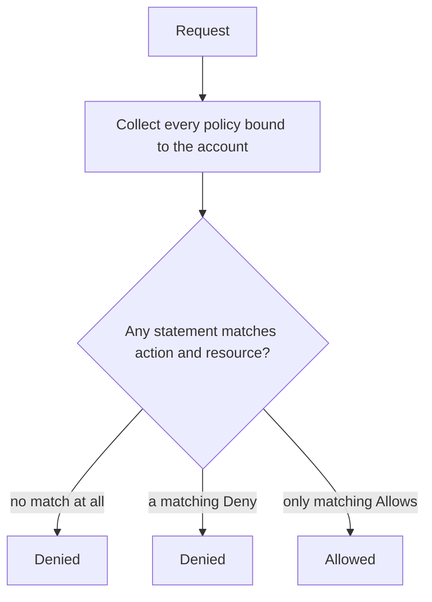

# Policies

A policy is a named list of statements. Statements grant or refuse actions on
resources. A policy does nothing until it is attached to a
[service account](service-accounts.md).

## Model

```json
{
  "name": "uploads-read-write",
  "description": "Read and write under the uploads bucket",
  "statements": [
    {
      "effect": "allow",
      "actions": ["s3:GetObject", "s3:PutObject", "s3:ListBucket"],
      "resources": ["bucket:uploads", "bucket:uploads/*"]
    }
  ]
}
```

A policy needs between 1 and 128 statements. Each statement needs at least one action
and at least one resource.

## Actions

| Action | Covers |
| --- | --- |
| `s3:ListBucket` | Listing a bucket's contents |
| `s3:GetObject` | Reading an object |
| `s3:PutObject` | Writing an object, including multipart and copy destinations |
| `s3:DeleteObject` | Deleting an object |
| `s3:GetObjectVersion` | Reading a specific version |
| `s3:DeleteObjectVersion` | Deleting a specific version |
| `s3:ManageBucket` | Creating and deleting buckets, and changing bucket settings |

Names are exact and case-sensitive. There is no wildcard action.

### How a request maps to an action

Record Store derives the action from the request itself:

| Request | Action |
| --- | --- |
| `GET /` | `s3:ListBucket` on `bucket:*` |
| `GET /<bucket>` | `s3:ListBucket` |
| Any other bucket-level request, or `GET /<bucket>?versioning`, `?cors` | `s3:ManageBucket` |
| `GET` or `HEAD` on a key | `s3:GetObject` |
| `GET` or `HEAD` on a key with `?versionId` | `s3:GetObjectVersion` |
| `DELETE` on a key | `s3:DeleteObject` |
| `DELETE` on a key with `?versionId` | `s3:DeleteObjectVersion` |
| Any other object request | `s3:PutObject` |

A copy request carries `x-amz-copy-source`. It is checked twice: `s3:PutObject` on the
destination and `s3:GetObject` on the source. An account that can write to the
destination but not read the source cannot copy.

## Resources

Resources use `bucket:` form:

| Pattern | Matches |
| --- | --- |
| `bucket:uploads` | the bucket itself — bucket-level operations |
| `bucket:uploads/photo.jpg` | exactly that object |
| `bucket:uploads/*` | every object in the bucket |
| `bucket:uploads/invoices/*` | every object under that prefix |
| `bucket:*` | every bucket and every object |

Rules enforced when a policy is created:

- A resource must start with `bucket:`.
- At most one `*`, and it must be the final character.
- No control characters.

`bucket:uploads/*/thumb.jpg` is rejected. Matching is a literal prefix comparison, not
a glob.

!!! note "Bucket and objects are separate resources"
    `bucket:uploads` does not cover `bucket:uploads/photo.jpg`, and `bucket:uploads/*`
    does not cover the bucket itself. A policy that lists a bucket *and* reads its
    objects needs both entries. This is the single most common mistake.

## Evaluation



Three properties follow, and they matter:

- **Default deny.** No matching statement means denied. There is no implicit access.
- **Explicit deny wins.** One matching `deny` refuses the request regardless of how
  many `allow` statements also match.
- **Policies are additive.** Attaching two policies grants the union of their allows,
  and the union of their denies.

Root and system principals bypass policy evaluation entirely.

## Creating a policy

Write the document to a file and create it:

```bash
record-store policy create ./uploads-read-write.json \
  --endpoint https://management.example.com
```

Then attach it:

```bash
record-store policy attach <policy-id> <account-id> \
  --endpoint https://management.example.com
```

Detach with the same arguments:

```bash
record-store policy detach <policy-id> <account-id> \
  --endpoint https://management.example.com
```

List what exists:

```bash
record-store policy list --endpoint https://management.example.com
```

Policy names must be unique. Creating one with a name already in use returns a
conflict.

## Worked examples

### Read-only over one prefix

```json
{
  "name": "reports-reader",
  "statements": [
    {
      "effect": "allow",
      "actions": ["s3:GetObject"],
      "resources": ["bucket:analytics/reports/*"]
    }
  ]
}
```

No `s3:ListBucket`, so the account can fetch a key it already knows and cannot
enumerate the bucket.

### Write-only drop box

```json
{
  "name": "ingest-writer",
  "statements": [
    {
      "effect": "allow",
      "actions": ["s3:PutObject"],
      "resources": ["bucket:ingest/*"]
    }
  ]
}
```

Suitable for an upload client that should never read back what others uploaded.

### Full access to one bucket

```json
{
  "name": "uploads-owner",
  "statements": [
    {
      "effect": "allow",
      "actions": [
        "s3:ListBucket",
        "s3:GetObject",
        "s3:PutObject",
        "s3:DeleteObject",
        "s3:GetObjectVersion",
        "s3:DeleteObjectVersion"
      ],
      "resources": ["bucket:uploads", "bucket:uploads/*"]
    }
  ]
}
```

`s3:ManageBucket` is deliberately absent: the application can use the bucket but
cannot delete it.

### Broad access with a carve-out

```json
{
  "name": "uploads-except-legal",
  "statements": [
    {
      "effect": "allow",
      "actions": ["s3:GetObject", "s3:PutObject", "s3:ListBucket"],
      "resources": ["bucket:uploads", "bucket:uploads/*"]
    },
    {
      "effect": "deny",
      "actions": ["s3:GetObject", "s3:PutObject"],
      "resources": ["bucket:uploads/legal/*"]
    }
  ]
}
```

The deny wins for anything under `legal/`, and the allow covers the rest.

### Preventing version deletion

```json
{
  "name": "no-history-deletion",
  "statements": [
    {
      "effect": "deny",
      "actions": ["s3:DeleteObjectVersion"],
      "resources": ["bucket:*"]
    }
  ]
}
```

Attach alongside a working policy. On a versioned bucket the account can still delete
objects — which writes a delete marker — but cannot erase history. See
[Versioning](../concepts/versioning.md).

## Testing a policy

Policies are easiest to verify from the account's own credentials:

```bash
AWS_ACCESS_KEY_ID=<account access key> \
AWS_SECRET_ACCESS_KEY=<account secret key> \
aws --endpoint-url https://storage.example.com s3 ls s3://uploads/
```

A refusal returns `403 AccessDenied`. Record Store does not say which statement was
responsible — that would leak the shape of a policy to a caller who cannot read it.
Work it out from the policy document instead.
