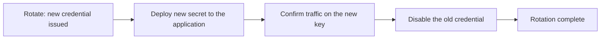

# Service Accounts

A service account is the identity an application uses. It holds one or more S3
credentials and gets its permissions from attached [policies](policies.md).

Use one per application, not one per person and not one shared across everything.
When something goes wrong, the account name is what tells you which system did it.

## Prerequisite

Creating or rotating a service account credential requires
`auth.credential_master_key`. Without it the request fails — credentials are stored
sealed under that key, and Record Store will not fall back to storing them any other
way.

```bash
RECORD_STORE_CREDENTIAL_MASTER_KEY=<your-master-key>
```

## Create

```bash
record-store service-account create image-pipeline \
  --endpoint https://management.example.com
```

The response is JSON containing the account, the credential, and the secret key.

!!! warning "The secret is shown once"
    Record Store stores a sealed form it cannot reverse. If the secret is lost, issue
    a new credential — it cannot be recovered.

Names are 1–128 characters and may not contain control characters.

To set a description, call the API directly — the CLI sends only the name:

```bash
curl -X POST https://management.example.com/api/v1/service-accounts \
  -H "Authorization: Bearer <your-management-token>" \
  -H "Content-Type: application/json" \
  -d '{"name":"image-pipeline","description":"Thumbnail generation worker"}'
```

Descriptions are optional and capped at 1024 characters.

Access keys are issued in the form `SA` followed by 20 uppercase hexadecimal
characters, so a Record Store service-account key is recognisable in a log.

## List and inspect

```bash
record-store service-account list --endpoint https://management.example.com

record-store service-account inspect <account-id> \
  --endpoint https://management.example.com
```

`inspect` shows the account, every credential it holds — including rotated and expired
ones — and the policies bound to it.

## Rotate a credential

```bash
record-store credential rotate <account-id> \
  --endpoint https://management.example.com
```

This issues a **new** credential alongside the existing one. The old credential keeps
working until you disable it. That is what makes a zero-downtime rotation possible:



Step 4 is not optional. A rotation that stops after step 2 has doubled the number of
live credentials rather than replaced one.

```bash
record-store credential disable <account-id> <credential-id> \
  --endpoint https://management.example.com
```

`credential enable` reverses it, which is the fast way back if step 3 was wrong.

## Disable an account

Disabling an account rejects every credential it holds, without deleting anything:

```bash
record-store service-account disable <account-id> \
  --endpoint https://management.example.com
```

Reach for this first during an incident. It is instant, reversible with
`service-account enable`, and leaves the audit trail intact.

## Delete an account

```bash
record-store service-account revoke <account-id> \
  --endpoint https://management.example.com
```

This removes the account and every access-key lookup for it permanently. Objects the
account wrote are untouched — they belong to the bucket, not to the account.

Prefer `disable` unless you are certain. A deleted account cannot be inspected later.

## Choosing between disable and delete

| Situation | Action |
| --- | --- |
| Suspected leak, cause unknown | `service-account disable` |
| One credential leaked, application still needed | `credential disable` on that credential |
| Application decommissioned | `service-account revoke` |
| Scheduled rotation | `credential rotate`, then `credential disable` |

## The root credential

The root credential comes from configuration, not from the account store. It is a
bootstrap identity: use it to create the first real service account, then take it out
of application use.

To stop it reaching the S3 API entirely:

```bash
RECORD_STORE_ROOT_S3_ENABLED=false
```

Do that once every application has its own service account. See the
[Security Checklist](../security/checklist.md).
