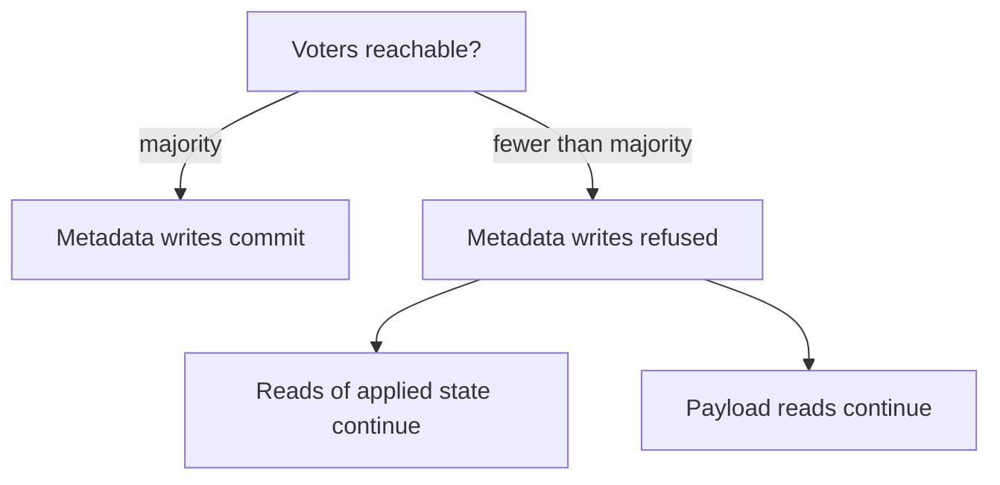

# Consensus

Cluster metadata — buckets, objects, versions, node membership, replica placement — is
replicated through Raft. Every node applies the same log in the same order, so they
agree on what exists and where it is.

Object **payloads** are not in consensus. They are replicated separately. See
[Replication](replication.md).

## Voters

Not every node votes. The cluster maintains a target number of voting members:

| Setting | Default | Constraint |
| --- | --- | --- |
| `metadata_voter_target` | 3 | 1–7, and must be **odd** |

Odd is enforced, not advised: an even voter count makes a quorum ambiguous and buys no
extra fault tolerance.

| Voters | Quorum | Tolerates |
| --- | --- | --- |
| 1 | 1 | 0 failures |
| 3 | 2 | 1 failure |
| 5 | 3 | 2 failures |
| 7 | 4 | 3 failures |

Quorum is `members / 2 + 1`.

Nodes beyond the voter target join as non-voting members. They hold the metadata and
serve reads without participating in elections — which keeps a 20-node cluster from
running a 20-member Raft group.

## Quorum status

```bash
record-store cluster status --endpoint https://management.example.com
```

The metadata section reports:

| Field | Meaning |
| --- | --- |
| `members` | Voting members configured |
| `healthy_members` | Voting members currently reachable |
| `quorum` | Members required to commit |
| `leader` | Current leader, when one is known |
| `writable` | Whether metadata writes can be committed |
| `readable` | Whether this member's applied state is usable for reads |
| `fault_tolerant` | Whether there are at least 3 voters |
| `notes` | Plain-language explanation of the classification |

Classification:

| Condition | Health |
| --- | --- |
| Leader known and all voters reachable | `healthy` |
| Leader known, quorum reachable, some voters missing | `degraded` |
| No leader, or fewer than quorum reachable | `unavailable` |
| No members registered | `unavailable` |

Read `notes`. It says exactly which condition applied and why, in words.

## Losing quorum

When fewer than a quorum of voters are reachable, **metadata writes stop cluster-wide**.
No bucket creation, no object writes, no membership changes.

Reads of already-applied metadata continue, and object payload reads continue.



Recovery is to bring voters back. There is no way to safely commit without a majority
— that is the property Raft provides, and bypassing it means accepting divergent
metadata.

Alert on it:

```yaml
- alert: RecordStoreMetadataQuorumLost
  expr: record_store_metadata_quorum_health == 0
  for: 1m
```

## Tuning

File-only settings, on each node:

```toml
[cluster]
consensus_heartbeat_millis = 250
election_timeout_min_millis = 1000
election_timeout_max_millis = 2000
snapshot_logs_threshold = 8192
retained_logs = 2048
```

| Setting | Purpose | Constraint |
| --- | --- | --- |
| `consensus_heartbeat_millis` | Leader heartbeat interval | 1–10000 |
| `election_timeout_min_millis` | Minimum before a follower starts an election | Must exceed twice the heartbeat |
| `election_timeout_max_millis` | Maximum | Must exceed the minimum |
| `snapshot_logs_threshold` | Entries before a snapshot is built | Greater than zero |
| `retained_logs` | Entries kept after a snapshot, for follower catch-up | — |

The election timeout is randomized within its range so followers do not all campaign
at the same instant.

The defaults suit a low-latency network. On a link with higher or more variable
latency, raise the heartbeat and the election timeouts together — keeping the
"min exceeds twice the heartbeat" relationship — otherwise transient delay is
mistaken for a dead leader and the cluster churns through elections.

Every node in a cluster should use the same values.

## Snapshots and log compaction

After `snapshot_logs_threshold` entries the state is snapshotted and the log is
compacted, keeping `retained_logs` entries so a slightly-behind follower can catch up
from the log instead of transferring a whole snapshot.

A follower that falls further behind receives the snapshot. That is heavier but not an
error.

`snapshot_logs_threshold` may not be zero — the log has to be compacted, or it grows
without bound.

## Leadership

One member is the leader; the rest are followers. Writes go to the leader, and requests
arriving at a follower are forwarded to it.

Leadership changes on leader failure or a network partition. A brief unavailability
during the election is expected — the cluster reports `degraded` and recovers on its
own.

Persistent leadership churn means the election timeout is too tight for the network.
Raise it.

## Consensus storage

The Raft log and snapshots live in `<data_directory>/metadata/consensus/`. They are
part of the metadata backup:

```bash
record-store server backup-metadata --output /backups/2026-08-29
```

Never delete this directory on a node you intend to keep in the cluster. A node that
loses its consensus state has lost its place in the group; the correct recovery is to
decommission it and rejoin as a new node with a fresh join token.
