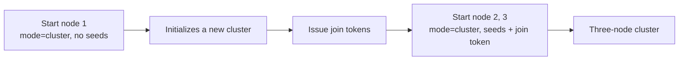

# Creating a Cluster

## Prerequisites

- Three or more machines that can reach each other on the RPC port (7603)
- The **same** `RECORD_STORE_CREDENTIAL_MASTER_KEY` on every node
- The same management tokens on every node
- Durable local storage on each — see [Persistent Storage](../deployment/persistent-storage.md)

!!! danger "The master key must be identical across nodes"
    It seals credentials, webhook secrets, and object data keys. Nodes with different
    master keys cannot read each other's sealed state. Generate it once, distribute it
    through your secret manager, and back it up before you begin.

## How the first node bootstraps

A node in `cluster` mode with **no seeds configured** initializes a new cluster: it
forms a single-member consensus group, generates a cluster ID, and persists its
identity.

That is the whole mechanism. There is no separate bootstrap command to run first.



## 1. Start the first node

```bash
RECORD_STORE_MODE=cluster
RECORD_STORE_S3_BIND=0.0.0.0:7600
RECORD_STORE_API_BIND=0.0.0.0:7601
RECORD_STORE_RPC_BIND=0.0.0.0:7603
RECORD_STORE_RPC_ADVERTISE=node-1.internal:7603
RECORD_STORE_CLUSTER_FAILURE_DOMAIN=region=eu-central,zone=a,rack=r1
RECORD_STORE_CLUSTER_S3_ENDPOINT=https://storage.example.com
RECORD_STORE_CLUSTER_REPLICATION_FACTOR=3
RECORD_STORE_ROOT_ACCESS_KEY=<your-access-key>
RECORD_STORE_ROOT_SECRET_KEY=<your-secret-key>
RECORD_STORE_CREDENTIAL_MASTER_KEY=<your-master-key>
RECORD_STORE_MANAGEMENT_SYSTEM_TOKEN=<your-system-token>
```

Two settings deserve attention:

- **`RECORD_STORE_RPC_ADVERTISE`** is the address *peers* use to reach this node. A
  bind address of `0.0.0.0` is not reachable from anywhere, so behind Docker,
  Kubernetes, or NAT this must be set explicitly. Getting it wrong is the most common
  cause of a node that starts but never joins.
- **`RECORD_STORE_CLUSTER_REPLICATION_FACTOR`** applies **only when this node
  initializes the cluster**. Changing it later on a running cluster does nothing. Set
  it now.

Confirm:

```bash
record-store cluster status --endpoint http://127.0.0.1:7601
```

One node, cluster ID assigned, health reported. A single-node cluster is `degraded` if
the replication factor is above 1 — expected until the other nodes join.

## 2. Issue join tokens

One token per node, from the running first node:

```bash
record-store cluster issue-join-token \
  --description "node-2" \
  --lifetime-seconds 3600 \
  --endpoint https://node-1.internal:7601
```

Lifetimes must be between 60 and 86400 seconds. Tokens are single-use — issue one per
node, and treat them as secrets: a token is authority to join the cluster.

## 3. Start the remaining nodes

```bash
RECORD_STORE_MODE=cluster
RECORD_STORE_RPC_ADVERTISE=node-2.internal:7603
RECORD_STORE_CLUSTER_SEEDS=node-1.internal:7603
RECORD_STORE_CLUSTER_JOIN_TOKEN=<token issued for node-2>
RECORD_STORE_CLUSTER_FAILURE_DOMAIN=region=eu-central,zone=b,rack=r2
RECORD_STORE_CLUSTER_S3_ENDPOINT=https://storage.example.com
# plus the same credentials, master key, and management tokens
```

`seeds` and `join_token` go together. A join token without seeds is refused — the
token says *what* is allowed, not *whom* to contact.

Give each node a **distinct failure domain** reflecting real physical separation.
Placement uses these labels to spread replicas; identical labels on every node mean
three replicas can land in the same rack.

## 4. Add a control node

Optional, and worth it. A `control` node serves the management API and holds no
replicas, which keeps administrative traffic off the storage nodes:

```bash
RECORD_STORE_MODE=control
RECORD_STORE_CLUSTER_SEEDS=node-1.internal:7603
RECORD_STORE_CLUSTER_JOIN_TOKEN=<token issued for the control node>
RECORD_STORE_RPC_ADVERTISE=control.internal:7603
```

Control mode **requires** seeds — a management-only process has no reason to form a
cluster of its own.

Point the console and the CLI at this node.

## 5. Verify

```bash
record-store cluster status --endpoint https://control.internal:7601
record-store node list --endpoint https://control.internal:7601
```

Look for:

- Every node in state `healthy`
- Metadata quorum writable
- Data plane writable
- Distinct failure domains
- Overall health `healthy`

Then round-trip an object and confirm it is replicated:

```bash
aws --endpoint-url https://storage.example.com s3 cp /tmp/test.bin s3://uploads/
record-store verify object uploads test.bin --endpoint https://control.internal:7601
```

## Common problems

| Symptom | Cause |
| --- | --- |
| Node starts but never appears in `node list` | `RECORD_STORE_RPC_ADVERTISE` is an address peers cannot reach |
| Join refused | Token expired, already used, or issued by a different cluster |
| Second node forms its **own** cluster | `seeds` was empty — it bootstrapped instead of joining |
| Nodes join but sealed state is unreadable | The master key differs between nodes |

The third is the one to watch for. A node with no seeds does not fail; it succeeds at
the wrong thing. Check `cluster_id` matches across nodes.

More in [Cluster Problems](../troubleshooting/cluster.md).
