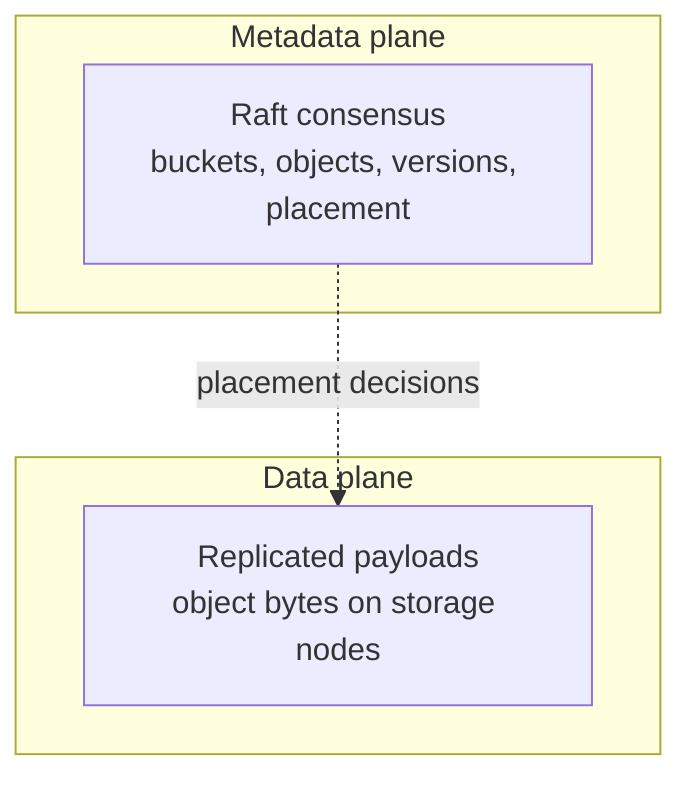

# Cluster

A Record Store cluster runs several nodes that replicate object payloads and agree on
metadata through Raft consensus.

!!! note "Standalone is not a lesser mode"
    A single process owning its own data is a first-class deployment. Cluster mode adds
    node redundancy and the operational weight that comes with it. Adopt it because you
    need to survive losing a machine, not because it sounds more serious.

<div class="grid cards" markdown>

-   **[Creating a Cluster](creating-a-cluster.md)** — the first node
-   **[Adding Nodes](adding-nodes.md)** — join tokens and seeds
-   **[Node Lifecycle](node-lifecycle.md)** — drain, maintenance, decommission
-   **[Replication](replication.md)** — where replicas go and why
-   **[Repair and Rebalance](repair-and-rebalance.md)** — restoring and evening out
-   **[Consensus](consensus.md)** — Raft, quorum, and what it protects

</div>

## Two planes



They fail independently, and the distinction runs through everything else:

| | Metadata | Data |
| --- | --- | --- |
| Mechanism | Raft consensus | Payload replication |
| Needs | A quorum of voters | Enough nodes to satisfy the replication factor |
| Lost quorum | No writes anywhere | Writes continue if placement can be satisfied |

`record-store cluster status` reports both, and overall health is the worse of the two.

## Node roles

| Mode | Serves S3 | Holds replicas | Serves management |
| --- | --- | --- | --- |
| `cluster` | yes | yes | yes |
| `control` | no | no | yes |

A `control` node is a management-only member. It participates in the cluster and holds
no object data, which makes it a good place to point the console and the CLI without
putting management traffic on a node that is busy serving objects.

## Sizing

Three storage nodes is the practical minimum. Consensus needs a majority to make
progress, so:

| Voters | Tolerates | Notes |
| --- | --- | --- |
| 1 | 0 failures | Not a cluster |
| 2 | 0 failures | Worse than one — either failure stops writes |
| 3 | 1 failure | The minimum worth deploying |
| 5 | 2 failures | For deployments that need it |

Even numbers of voters buy nothing. Four tolerates the same single failure as three.

The default `replication_factor` is 3, and the validated range is 1–3.

## Health

| Value | Meaning |
| --- | --- |
| `healthy` | Every dimension nominal |
| `degraded` | Reduced redundancy; reads and writes still meet their contracts |
| `critical` | Durability or availability guarantees are actively violated |
| `unavailable` | The cluster cannot serve its core contract |

```bash
record-store cluster status --endpoint https://management.example.com
```

`degraded` during a rolling restart is expected and resolves itself. `critical` and
`unavailable` are pages.
