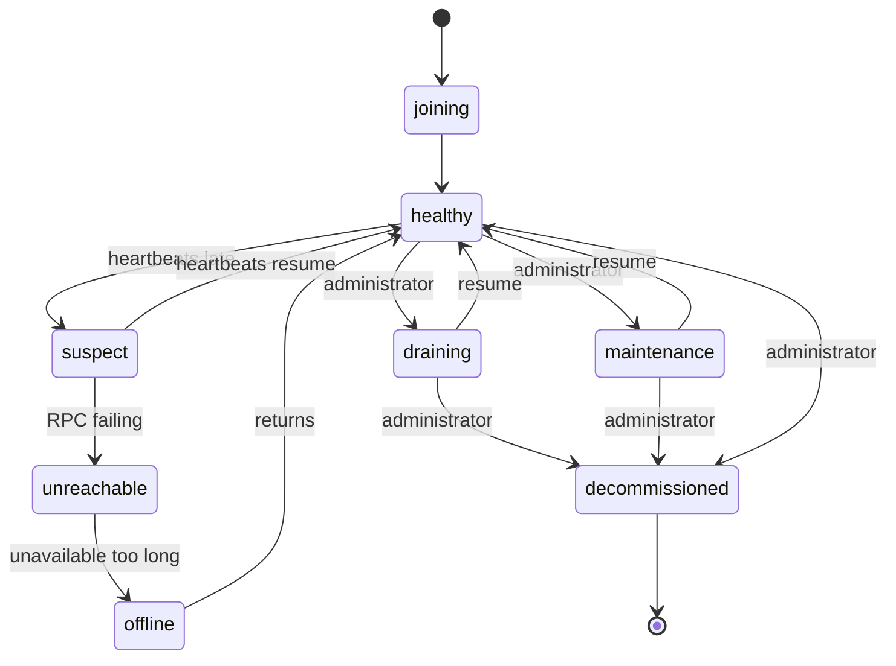

# Node Lifecycle

Every node is in exactly one state. Some states are chosen by an administrator; others
are set by failure detection. The distinction matters: **failure detection never
overrides an administrative state.**

## States

| State | Takes new replicas | Serves reads | Counts for durability | Set by |
| --- | --- | --- | --- | --- |
| `joining` | no | no | no | system |
| `healthy` | **yes** | yes | yes | system |
| `suspect` | no | yes | yes | failure detection |
| `unreachable` | no | no | yes | failure detection |
| `draining` | no | yes | yes | administrator |
| `maintenance` | no | no | yes | administrator |
| `offline` | no | no | **no** | failure detection |
| `decommissioned` | no | no | no | administrator |

Only `healthy` accepts new replicas. Everything else is some degree of stepping back.

!!! note "`suspect` and `unreachable` still count for durability"
    A node whose heartbeats are late has not lost its data. Repairing immediately after
    a transient network blip causes a recovery storm that is worse than the blip.
    Replicas stop counting only at `offline`, after the node has been considered
    unavailable long enough.

`decommissioned` is terminal. There is no transition out of it.

## Transitions



Repeating a node's current state is always allowed, so `drain` and `maintenance` are
safely idempotent.

## Maintenance

For a short planned interruption — a reboot, a kernel upgrade, a disk swap.

```bash
record-store node maintenance <node-id> --endpoint https://management.example.com
```

The node keeps its data and stops receiving new replicas. Its replicas still count
toward durability, so the cluster does not start copying them elsewhere.

Bring it back:

```bash
record-store node resume <node-id> --endpoint https://management.example.com
```

Use this when the node is coming back. It is the cheap option: nothing is copied.

## Drain

For moving a node's data off it — before permanent removal, or to empty a machine you
are about to repurpose.

```bash
record-store node drain <node-id> --endpoint https://management.example.com
```

The node stops receiving new replicas, keeps serving reads, and its existing replicas
are progressively moved elsewhere.

Watch it:

```bash
record-store cluster status --endpoint https://management.example.com
record-store rebalance status --endpoint https://management.example.com
```

Draining copies real data over the network. Its speed is bounded by
`cluster.movement_bytes_per_second` (default 64 MiB/s per movement) and
`cluster.movement_concurrency` (default 4). On a large node this takes hours — plan
for it.

A drain can be reversed with `resume` while it is in progress.

## Decommission

Permanent removal.

```bash
record-store node decommission <node-id> --endpoint https://management.example.com
```

A safety check runs first. It scans every placement and refuses if removing the node
would make any object version unreadable or drop it below the required durability. The
error says exactly how many versions are affected.

If the node still holds replicas, decommission **moves them first** — it puts the node
into `draining` and completes once the data is elsewhere. A node with no replicas left
goes straight to `decommissioned`.

### Forcing

```bash
record-store node decommission <node-id> --force \
  --endpoint https://management.example.com
```

`--force` bypasses the durability objection. It does **not** skip the data movement.

Use it only when the node is physically gone and its data is already lost — otherwise
you are accepting the loss the safety check just warned about. A mistyped node ID
plus `--force` destroys durability, which is exactly why the check is mandatory
without it.

The safe order is always: `drain`, wait for it to finish, then `decommission`.

## Inspecting

```bash
record-store node list --endpoint https://management.example.com
record-store node inspect <node-id> --endpoint https://management.example.com
```

`inspect` reports the state, RPC address, storage class, failure domain, software
version, capacity and utilization, replica count, and last heartbeat.

## Rolling restart

```bash
for node in node-1 node-2 node-3; do
  record-store node maintenance "$node" --endpoint https://management.example.com
  # stop, upgrade, start the node
  record-store node resume "$node" --endpoint https://management.example.com
  # wait for the cluster to report healthy before continuing
done
```

Two rules:

- **One node at a time.** A three-node cluster loses metadata quorum when two are down.
- **Wait for healthy between nodes.** Not for the command to return — for
  `cluster cluster status` to report the cluster healthy again.

Use `maintenance`, not `drain`: the node is coming straight back, and there is no
reason to copy its data twice.

See [Upgrading](../deployment/upgrading.md).

## Replacing a failed node

When a node is gone for good:

1. Confirm it is `offline` — its replicas have stopped counting and repair is already
   restoring redundancy elsewhere.
2. Let repair finish: `record-store repair status`.
3. `record-store node decommission <node-id> --force` — the data is genuinely gone, so
   the objection is moot.
4. Start a replacement with a fresh join token and an empty data directory.

Do not reuse the failed node's identity or its data directory. Join the replacement as
a new node.
