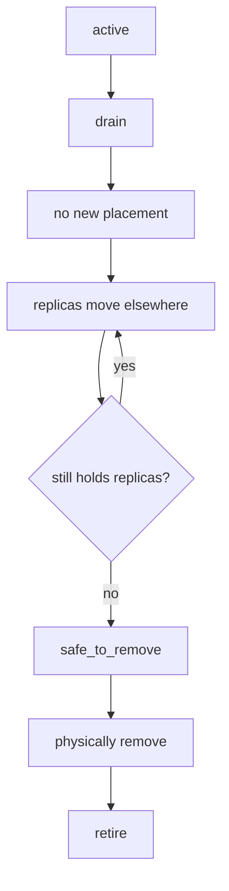

# Replacing a Drive

Removing a drive from a running cluster is a durability operation, not a
hardware one. The order matters: **evacuate, verify, then pull.**

## The sequence



Nothing here reports success early. `safe_to_remove` is refused while the device
still owns replica records, so it means evacuation genuinely finished rather
than that somebody asked for it.

## 1. Find the drive

```bash
record-store drive list
```

```bash
record-store drive show <node> <device>
```

Note the stable device identifier. Do not use the path — it can change.

## 2. Start the drain

```bash
record-store drive drain <node> <device>
```

The device stops receiving new data immediately. Its existing replicas keep
serving reads and keep counting toward durability, because they are still real
copies until they have been moved.

The coordinator schedules the evacuation as ordinary movement work, bounded by
the same limits that protect foreground traffic.

## 3. Watch it drain

```bash
record-store repair status
```

```bash
record-store drive show <node> <device>
```

A drain can take hours on a large drive. It survives restarts: the intent is
durable cluster state, not something held in a running process, so a node that
restarts mid-drain does not quietly put the disk back into service.

!!! warning "Evacuation needs somewhere to go"
    A drain can only complete if the remaining devices can satisfy the storage
    policy. Draining a drive in a cluster that is already at its watermark, or
    that has too few failure domains left, will not finish. Check capacity
    before starting, not after.

## 4. Confirm it is safe

```bash
record-store drive release <node> <device>
```

This is the durability check. It **fails** while the device still owns replicas:

```text
device still owns replica records; evacuation is incomplete
```

That failure is the feature. Re-run it once the drain has progressed.

On success the device is `safe_to_remove`, and removing the hardware no longer
puts any object below its required durability.

## 5. Remove the hardware

Physically remove the drive. Nothing is holding it open for placement.

## 6. Retire the record

```bash
record-store drive retire <node> <device>
```

Retiring is permanent and asks for confirmation. In automation, pass `--yes`
explicitly; the command refuses to proceed on a non-interactive terminal
without it rather than treating an empty pipe as agreement.

## When a drive fails on its own

A failed device is a different situation: there is no evacuation, because the
bytes are already gone.

```text
device fails
    ↓
excluded from placement immediately
    ↓
its replicas stop counting toward durability
    ↓
affected objects are identified
    ↓
repair rebuilds copies elsewhere
    ↓
durability restored
```

An operator does not enumerate the affected objects by hand. The cluster already
knows which placements named that device.

```bash
record-store repair status
```

Once repair has finished, the failed device can go straight to
`safe_to_remove` — it holds nothing that still counts.

## Before you start: what will move

```bash
record-store placement simulate remove-device <node> <device>
```

This runs the real placement engine against a cluster map without the device and
reports what would move, without changing anything. `placements_unsatisfiable`
above zero means the remaining devices cannot satisfy the policy — evacuate
somewhere else first, or the drain will not finish.

The same command answers the expansion question:

```bash
record-store placement simulate add-node --device-bytes 4000000000000
```

## Adding the replacement

```bash
record-store drive activate <node> <device>
```

A new device joins the cluster map, which advances the placement epoch. New
writes can use it immediately.

Existing data does **not** all move. Placement is deterministic and stable:
adding one device to a four-device cluster relocates roughly a fifth of objects,
not all of them. Expansion is a background rebalance, not a migration.

See [Repair and Rebalance](repair-and-rebalance.md).
