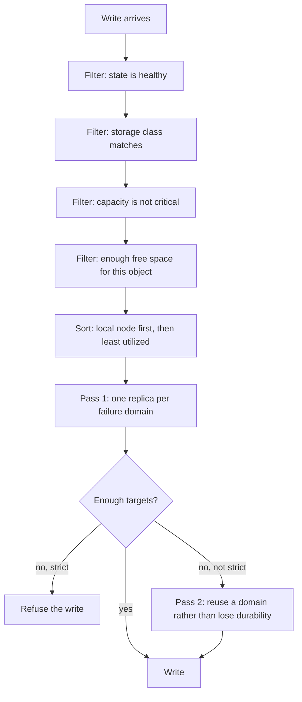

# Replication

Every object payload is stored on several nodes. Placement decides which ones.

## Replication factor

The number of copies of each payload. Default `3`, validated range `1..=3`.

```bash
RECORD_STORE_CLUSTER_REPLICATION_FACTOR=3
```

!!! warning "Only applies at cluster initialization"
    This setting is read when a node **initializes a new cluster**. Setting it on a
    node that joins an existing cluster has no effect, and changing it later does not
    re-place existing data. Decide it before you create the cluster.

A standalone deployment uses a factor of 1 and requires all replicas to acknowledge —
which is the same thing when there is one.

## Write acknowledgement

How many replicas must be durable before a write is acknowledged to the client.

| Setting | Required durable replicas | With factor 3 |
| --- | --- | --- |
| `Quorum` (default) | `factor / 2 + 1` | 2 |
| `All` | `factor` | 3 |
| `Count(n)` | `n`, clamped to `1..=factor` | as set |

Quorum is the default because it survives one node being slow or down without
sacrificing durability: two independent copies are durable before the client is told
the write succeeded, and the third follows.

This is replicated cluster policy, not node-local configuration — every node must
agree on it, so it does not appear in the TOML file or the environment.

## Placement



The filters, in order:

1. **State.** Only `healthy` nodes accept new replicas.
2. **Storage class.** The node's class must match what the request asks for.
3. **Capacity level.** Nodes at the critical watermark are excluded.
4. **Free space.** The node must have room for the object plus a safety margin
   (default 1 GiB). A streaming upload with no known length is assumed to be 64 MiB.

Ordering is deterministic: the ingress node first (so it writes locally without a
network hop), then least utilized, then a stable hash. Every node computes the same
plan from the same topology.

## Failure domains

A failure domain is what you expect to fail together. Labels are declared per node:

```bash
RECORD_STORE_CLUSTER_FAILURE_DOMAIN=region=eu-central,zone=a,rack=r1
```

The cluster groups by one **scope**:

| Scope | Groups by | Survives losing |
| --- | --- | --- |
| `node` | the node itself | one node |
| `host` | `host=` | one physical host |
| `rack` (default) | `rack=` | one rack |
| `zone` | `zone=` | one availability zone |
| `region` | `region=` | one region |

The first placement pass puts at most one replica in each domain. If it cannot find
enough distinct domains:

- **Not strict** (default): a second pass reuses a domain. Two replicas in one rack is
  worse than three, but far better than refusing the write. The plan is flagged as
  having reused domains.
- **Strict**: the write is refused with `InsufficientFailureDomains`.

Non-strict is the default because losing writes is usually worse than losing spread.
Choose strict when a domain-level guarantee is a compliance requirement rather than a
preference.

Labels only describe reality — they do not create it. Three nodes all labelled
`rack=r1` give you one rack's worth of durability no matter what the scope is set to.

## Capacity watermarks

```bash
RECORD_STORE_CLUSTER_CAPACITY_LOW_WATERMARK_PERCENT=80
RECORD_STORE_CLUSTER_CAPACITY_HIGH_WATERMARK_PERCENT=90
RECORD_STORE_CLUSTER_CAPACITY_CRITICAL_WATERMARK_PERCENT=95
```

Must satisfy `0 < low < high < critical <= 100`.

A node at critical is excluded from new placement entirely. The lower watermarks feed
capacity-aware ordering, so a node fills more slowly as it approaches them.

## Reading

A read needs one `healthy` replica. Nodes in `healthy`, `suspect`, or `draining` serve
reads; `maintenance` does too when the cluster's `maintenance_serves_reads` policy
allows it, which it does by default.

Replica states:

| State | Readable | Counts for durability |
| --- | --- | --- |
| `pending` | no | no |
| `healthy` | **yes** | yes |
| `repairing` | no | no |
| `stale` | no | no |
| `missing` | no | no |
| `deleting` | no | no |
| `corrupt` | no | no |

Only `healthy` is both. A payload with no healthy replica is unavailable and appears in
`unavailable_payloads`.

## Monitoring

```bash
record-store cluster status --endpoint https://management.example.com
```

The two numbers that matter:

| | Meaning | Action |
| --- | --- | --- |
| `under_replicated_payloads` | Fewer healthy replicas than desired | Expected during a node outage; should trend to zero |
| `unavailable_payloads` | **No** healthy replica at all | Data is unreadable. Investigate immediately |

Prometheus exposes the first as `record_store_under_replicated_objects`. See
[Metrics](../administration/metrics.md).

## When placement fails

| Error | Meaning |
| --- | --- |
| `NoEligibleNodes` | No node passed the filters. The message reports how many were healthy, class-matching, and had capacity — read it to see which filter bit |
| `InsufficientFailureDomains` | Strict mode, and not enough distinct domains |
| `InsufficientDurability` | Fewer eligible targets than the acknowledgement requirement |

`NoEligibleNodes` is usually capacity or storage class, not health. The counts in the
message tell you which.
