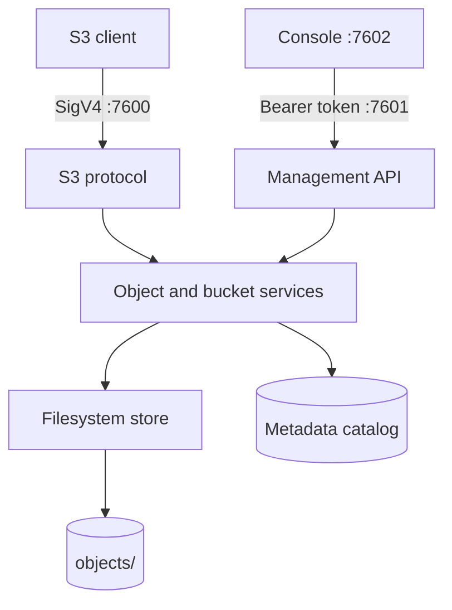
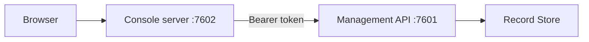

# Architecture

Record Store is one Rust workspace. Protocol crates call shared application services;
they never reach into storage internals directly.

## Request path



Both protocol surfaces go through the same service layer, so an object written over S3
and an object written through the console are the same object under the same rules.

## Console path



The browser only ever talks to the console's own origin. The console server attaches
the management credential server-side, so it lives in an HTTP-only cookie the page
cannot read, no CORS configuration is required, and the browser never reaches the
management API, the stored objects, or the metadata catalog.

## Crates

| Crate | Responsibility |
| --- | --- |
| `record-store-core` | Validated domain model: names, keys, checksums, ranges |
| `record-store-service` | Shared bucket and object application services |
| `record-store-s3` | S3 protocol, SigV4, XML, multipart, versioning |
| `record-store-api` | Management HTTP API and management roles |
| `record-store-storage` | Streaming filesystem backend and recovery journal |
| `record-store-metadata` | Durable indexed catalog and ordered migrations |
| `record-store-auth` | Encrypted credentials and authorization policies |
| `record-store-audit` | Durable bounded security audit trail |
| `record-store-sharing` | Share and embed capabilities |
| `record-store-events` | Durable events and signed webhook delivery |
| `record-store-lifecycle` | Incremental expiration worker |
| `record-store-config` | Configuration loading and validation |
| `record-store-observability` | Structured tracing initialization |
| `record-store-erasure` | Reed-Solomon library, **not currently wired in** |

See [Repository Structure](../contributing/repository-structure.md) for the layout
including applications and the console.

## On-disk layout

```text
<data-directory>/
├── metadata/catalog.redb
├── metadata/credentials.redb
├── metadata/audit.redb
├── metadata/events.redb
├── metadata/lifecycle.redb
├── objects/<2 hex>/<2 hex>/<object UUID>
├── system/
└── tmp/
```

Payloads are addressed by generated UUID. No bucket name or object key ever becomes
part of a filesystem path.
