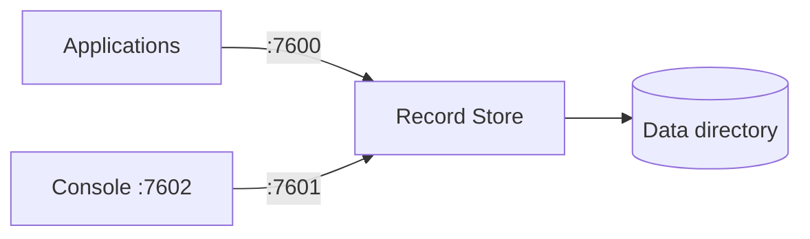
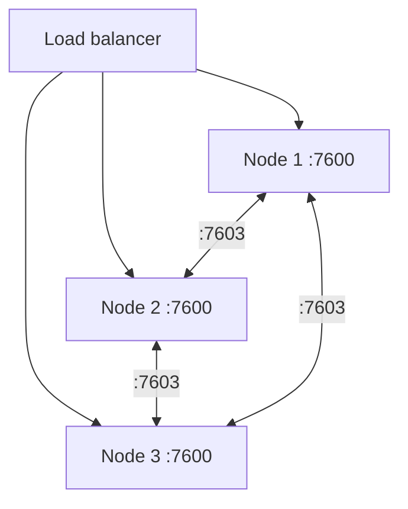
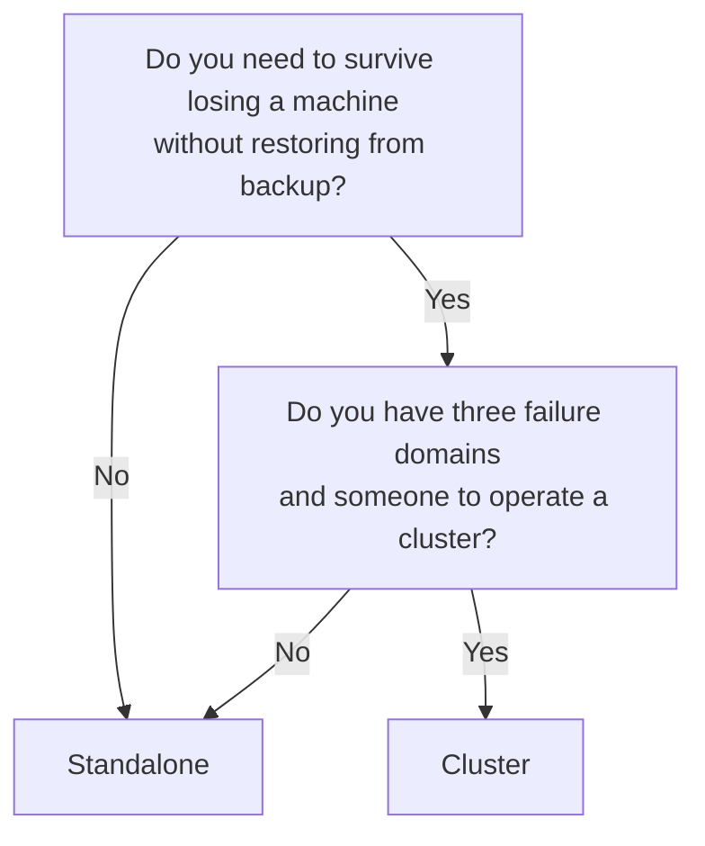

# Deployment Modes

`server.mode` selects what a Record Store process does. It is set with
`RECORD_STORE_MODE` and defaults to `standalone`.

| Mode | Stores objects | Joins consensus | Internal RPC listener |
| --- | --- | --- | --- |
| `standalone` | Yes | No | Not started |
| `cluster` | Yes | Yes | Started on 7603 |
| `control` | No | Yes | Started on 7603 |

## Standalone

One process, one copy of the data, no cluster configuration.

Standalone is the default and the right starting point. It has no quorum to lose, no
placement to reason about, and no internal network to secure. Its limit is obvious:
if the machine is gone, the service is gone until you restore it.

Durability in standalone mode is whatever the underlying disk gives you. Use
redundant storage and take [backups](../operations/backup-and-restore.md).

## Cluster

Several storage nodes replicate objects between themselves and agree on metadata
through a Raft group.

A cluster survives losing a node. It costs you a distributed system: quorum, node
lifecycle, repair, rebalancing, and an internal network that must be secured.

!!! warning "A cluster alone does not make your endpoint highly available"
    Clients still connect to *some* address. Put healthy S3 ingress nodes behind a
    load balancer, or losing the node your clients point at still takes you down.

Use at least **three** metadata voters and three failure-domain-separated storage
nodes. Two voters cannot survive either member's loss — a two-member Raft group needs
both to reach quorum, which is worse than one.

## Control

A `control` process joins consensus and serves the management API, but stores no
object replicas. It is useful as a management entry point that does not carry data.

The shipped `deploy/docker/compose.cluster.yml` uses one for exactly that.

## Choosing

Moving from standalone to cluster is a migration, not a switch: a standalone catalog
is not a Raft group. Plan it as a data migration with a backup taken first.

## Related

- [Durability](durability.md) — what a write guarantees in each mode
- [Cluster Overview](../cluster/index.md) — running a cluster
