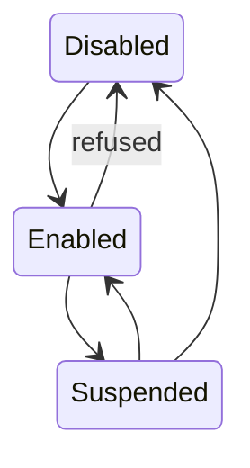

# Versioning

Versioning keeps previous copies of an object instead of discarding them when a key is
overwritten or deleted. It is configured per bucket.

## States

| State | Meaning |
| --- | --- |
| `Disabled` | The default. Writing a key replaces it. Deleting removes it. |
| `Enabled` | Every write creates a new version. Deleting adds a delete marker. |
| `Suspended` | History already written is kept. New writes replace a single "null" version. |

=== "CLI"

    ```bash
    record-store bucket versioning get demo
    record-store bucket versioning enable demo
    record-store bucket versioning suspend demo
    ```

=== "AWS CLI"

    ```bash
    aws --endpoint-url http://127.0.0.1:7600 s3api put-bucket-versioning \
      --bucket demo --versioning-configuration Status=Enabled
    ```

### Transitions

Once versioning has been **enabled**, it cannot be set directly back to `Disabled`.
That transition would strand the versions already written, so Record Store refuses it
with `InvalidVersioningTransition`.



Suspending first and then disabling is permitted. Do it deliberately: it is the path
that lets history stop being maintained.

## Version IDs

Each version has a `VersionId`. Reads and deletes can name one explicitly:

```bash
aws --endpoint-url http://127.0.0.1:7600 s3api get-object \
  --bucket demo --key report.pdf --version-id <version-id> ./report-old.pdf
```

`ListObjectVersions` returns the history, newest first, marking which entry is current.

## Delete markers

Deleting a key in an enabled bucket does not remove anything. It writes a **delete
marker** that becomes the current version, so ordinary reads return `NoSuchKey` while
every earlier version stays addressable by its `VersionId`.

Writing the key again makes the new object current. The delete marker stays in the
history where it happened.

Deleting a specific *version* does remove that version. If it was the current one, the
next most recent version is promoted.

## Restore

Restoring an old version does not move a pointer backwards. It **copies that version's
bytes into a new current version**:

```bash
curl -X POST \
  -H "Authorization: Bearer $RECORD_STORE_MANAGEMENT_TOKEN" \
  -H 'content-type: application/json' \
  -d '{"version_id":"<version-id>"}' \
  http://127.0.0.1:7601/api/v1/restore/demo/report.pdf
```

The response is `201 Created` and describes the new version. The version you restored
from is untouched, and the version that was current before the restore stays in the
history. Nothing is lost, and the operation is itself reversible.

## Storage cost

Versions are full objects, not deltas. A bucket with versioning enabled grows with
every write. Use [lifecycle rules](../administration/lifecycle-rules.md) to expire
non-current versions on a schedule, and watch `version_bytes` in the
[metrics](../administration/metrics.md).
