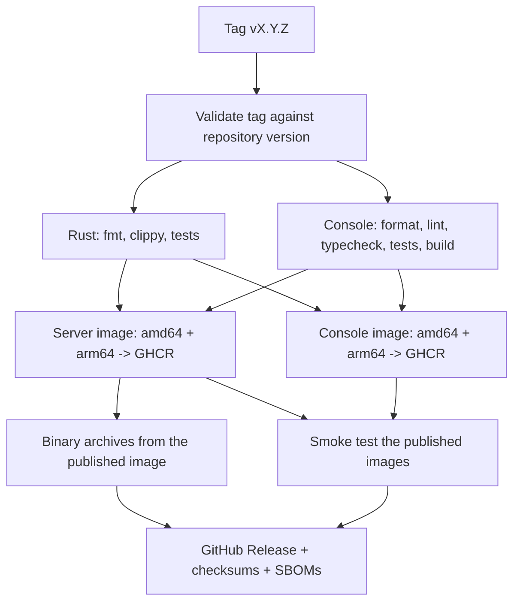

# Releasing

Record Store releases are produced by GitHub Actions from a version tag. A
maintainer decides the version, writes the changelog, and pushes a tag; nothing
is built or uploaded by hand.

## What a tag triggers

Pushing `vX.Y.Z` runs `.github/workflows/release.yml`:



The GitHub Release is created last and depends on everything before it, so a
failed build never leaves a release behind. Images are pushed before the release
exists, but only after every gate has passed and both architectures have built.

## The procedure

### 1. Choose the version

Semantic versioning. A patch release for fixes, a minor release for additions, a
major release for breaking changes. Before 1.0, judgement applies: a rename or a
configuration break deserves at least a minor bump.

### 2. Update the version and the changelog

The version lives in two places, and the release fails if they disagree with the
tag:

| File | Field |
| --- | --- |
| `Cargo.toml` | `[workspace.package] version` — every crate inherits it |
| `console/package.json` | `version` |

Update the lockfiles too:

```bash
cargo update --workspace
cd console && npm install --package-lock-only
```

Then add the section to `CHANGELOG.md`. It becomes the release notes verbatim, so
write it for the people upgrading, and note anything that requires action on their
part. **A missing changelog section fails the release** — that is deliberate.

Check the versions agree before you tag:

```bash
.github/scripts/release-version.sh vX.Y.Z
```

### 3. Merge the release preparation

Open a pull request and let CI pass. Release preparation is an ordinary change
and belongs on the default branch before it is tagged.

### 4. Tag the merge commit

Tag on `main`, at the commit the release is cut from, with a clean working tree:

```bash
git switch main
git pull
git status              # must be clean
git tag -s vX.Y.Z -m "Record Store vX.Y.Z"
```

`-s` signs the tag with GPG; `git tag -s` with `gpg.format=ssh` signs with an SSH
key.

**Sign the tag.** Images are published unsigned (see below), so the tag signature
is the only cryptographic statement about who produced a release. It is not
enforced by the workflow, because a release that fails at the last step for want
of a key on the right machine helps nobody — but an unsigned release tag leaves
consumers with nothing to check.

### 5. Push

```bash
git push origin main
git push origin vX.Y.Z
```

### 6. Verify

Watch the run, then check the result the way a consumer would:

```bash
gh run watch

docker pull ghcr.io/openelementslabs/record-store:X.Y.Z
docker run --rm --entrypoint record-store \
  ghcr.io/openelementslabs/record-store:X.Y.Z --version
git tag -v vX.Y.Z
```

See [Verifying a Release](../deployment/verifying-releases.md).

## Never repoint a version tag

A published version is immutable. If `0.1.1` is wrong, release `0.1.2`.

Do not delete and recreate a Git tag, and do not rebuild an image under a version
tag that has already been published. Anyone who pinned a digest is unaffected by a
repointed tag, but everyone else silently gets different software under a name
they already trusted.

## Images are published unsigned

The workflow does not attest image provenance. `actions/attest-build-provenance`
requires GitHub's artifact attestation service, which is unavailable to a private
repository outside an Enterprise plan — it fails the job outright with
`Feature not available for the … organization`.

The alternatives were weighed and rejected for now:

| Option | Why not |
| --- | --- |
| BuildKit `provenance: mode=max` | Unsigned metadata. Anyone who can push to the registry can write the same blob, so it proves nothing while looking like it does. |
| `cosign` keyless via OIDC | Works on a private repository and would give real signatures, but publishes the repository name, workflow path, and commit SHA to Sigstore's public Rekor transparency log. |

Two changes would each enable signed provenance with no change to the pipeline's
shape: **making the repository public**, or **moving the organisation to a plan
that includes attestations**. If either happens, restore the
`actions/attest-build-provenance` step on the merged index digest and
`actions/attest-sbom` on each platform digest, add back `id-token: write` and
`attestations: write`, and update
[Verifying a Release](../deployment/verifying-releases.md).

Until then, do not describe a Record Store image as signed, verified, or
attested, and do not add a badge saying so.

## One-time GitHub configuration

Some of this cannot be expressed in the repository and has to be set once in the
GitHub UI by someone with admin rights.

| Setting | Where | Why |
| --- | --- | --- |
| **Immutable releases** | Repository → Settings → General → Releases | Prevents a published release's assets and tag from being changed after the fact. The workflow treats versions as immutable, but only this setting enforces it. |
| **Package visibility** | Each package → Package settings → Change visibility | Packages inherit private visibility from a private repository. Anonymous `docker pull` requires setting each package to public, explicitly. |
| **Package repository link** | Each package → Package settings | Usually automatic: the images carry `org.opencontainers.image.source`, which GitHub uses to attach the package to this repository. Link it by hand if it does not appear. |
| **Actions permissions** | Repository → Settings → Actions → Workflow permissions | The release workflow needs `GITHUB_TOKEN` to be allowed to write packages. Organisation policy can override the workflow's own `permissions` block. |

Until the immutable-releases setting is enabled, a release is immutable by
convention only. Do not describe it as enforced.

## Runners

The container jobs build `linux/arm64` on `ubuntu-24.04-arm`, a GitHub-hosted
Arm runner, rather than under QEMU: emulating a release build of the Rust
workspace turns a ten-minute job into an hour-long one. These runners are
available to the organisation's plan. If that ever changes, the alternative is
QEMU via `docker/setup-qemu-action`, at that cost.
