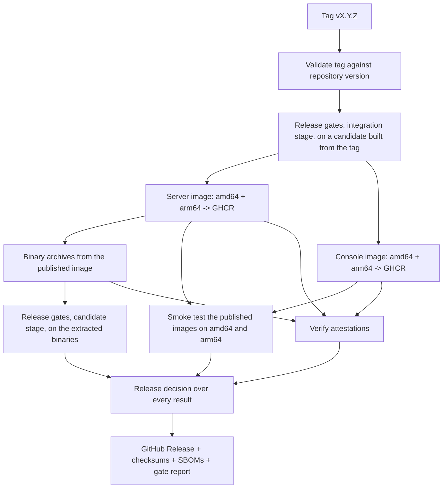

# Releasing

Record Store releases are produced by GitHub Actions from a version tag. A
maintainer decides the version, writes the changelog, and pushes a tag; nothing
is built or uploaded by hand.

## What a tag triggers

Pushing `vX.Y.Z` runs `.github/workflows/release.yml`:



The GitHub Release is created last and depends on the release decision, which
evaluates every gate in [`release/gates.toml`](release-gates.md) for this
candidate. A failed or missing gate, an open finding that blocks release, or an
expired quarantine stops the release; the decision is attached to the release
as `record-store-X.Y.Z-release-gates.json` and `.md`. Images are pushed only
after the pre-publish gates pass; a failure after that point leaves a tagged
image without a release, which is never repointed.

Run the candidate evaluation before tagging, from the Actions tab (**Gates →
Run workflow → candidate**) on the commit you intend to tag. It runs the same
gates the release will, without publishing anything.

## The procedure

### 1. Choose the version

Semantic versioning. A patch release for fixes, a minor release for additions, a
major release for breaking changes. Before 1.0, judgement applies: a rename or a
configuration break deserves at least a minor bump.

### 2. Update the version and the changelog

The version lives in two places, and the release fails if they disagree with the
tag:

| File | Field |
| --- | --- |
| `Cargo.toml` | `[workspace.package] version` — every crate inherits it |
| `console/package.json` | `version` |

Update the lockfiles too:

```bash
cargo update --workspace
cd console && npm install --package-lock-only
```

The version also appears in documentation examples and as the Compose default,
where nothing validates it. Those are not read by the release, but a reader who
copies them gets the previous release:

| File | What to update |
| --- | --- |
| `deploy/docker/compose.ghcr.yml` | `RECORD_STORE_VERSION` default, both images |
| `deploy/docker/docker-compose.ghcr.yaml` | `RECORD_STORE_VERSION` default, both images |
| `docs/deployment/container-images.md` | Tag table and examples |
| `docs/deployment/docker-compose.md`, `docs/deployment/upgrading.md` | Examples |
| `docs/getting-started/installation.md`, `README.md` | Pinned-version examples |

`grep -rn "X\.Y\.Z" docs deploy README.md` finds the previous release's
leftovers. Leave references that are deliberately historical, such as which
releases predate build attestation.

Then add the section to `CHANGELOG.md`. It becomes the release notes verbatim, so
write it for the people upgrading, and note anything that requires action on their
part. **A missing changelog section fails the release** — that is deliberate.

Check the versions agree before you tag:

```bash
.github/scripts/release-version.sh vX.Y.Z
```

### 3. Merge the release preparation

Open a pull request and let CI pass. Release preparation is an ordinary change
and belongs on the default branch before it is tagged.

### 4. Tag the merge commit

Tag on `main`, at the commit the release is cut from, with a clean working tree:

```bash
git switch main
git pull
git status              # must be clean
git tag -s vX.Y.Z -m "Record Store vX.Y.Z"
```

`-s` signs the tag with GPG; `git tag -s` with `gpg.format=ssh` signs with an SSH
key.

**Sign the tag.** Image provenance is attested automatically (see below), but the
tag signature is the only statement about who *cut* the release rather than what
built it. It is not enforced by the workflow, because a release that fails at the
last step for want of a key on the right machine helps nobody — but an unsigned
release tag leaves consumers one check short.

### 5. Push

```bash
git push origin main
git push origin vX.Y.Z
```

### 6. Verify

Watch the run, then check the result the way a consumer would:

```bash
gh run watch

docker pull ghcr.io/openelementslabs/record-store:X.Y.Z
docker run --rm --entrypoint record-store \
  ghcr.io/openelementslabs/record-store:X.Y.Z --version
git tag -v vX.Y.Z
```

See [Verifying a Release](../deployment/verifying-releases.md).

## Release checklist

The workflow enforces most of this; the list exists so a human can see what is
being enforced and why. **Items marked *enforced* fail the run — the release is
not created.**

Before tagging:

- [ ] `CHANGELOG.md` has a section for this version, written for the person
      upgrading, with no entries left under `## [Unreleased]`
- [ ] The workspace version matches the tag — *enforced by the `validate` job*
- [ ] A **candidate** run of the Gates workflow on the commit to be tagged is
      `READY` (or `READY WITH EXCEPTIONS`, each exception reviewed) — *the same
      gates are enforced again by the release*
- [ ] No open finding in `release/findings/` blocks release — *enforced*
- [ ] Any upgrade step a deployment must take is stated in the changelog, not
      only in a pull request description

Produced by the run, and all *enforced*:

- [ ] Every gate of the integration stage passes before any image is pushed
- [ ] Both images built for `linux/amd64` and `linux/arm64`
- [ ] **Signed provenance on the server image index**
- [ ] **Signed provenance on the console image index**
- [ ] **An SPDX SBOM attested per architecture**, bound to the platform manifest it
      describes rather than to the index
- [ ] **Signed provenance on every binary archive**
- [ ] The candidate-stage gates pass against the binaries extracted from the
      published image, including recovery, upgrade, integrity and redaction
- [ ] The published images pass the smoke test on both architectures: correct
      version, non-root, clean exit on SIGTERM, data persists across a restart
- [ ] The release decision is `READY` and is attached to the release
- [ ] `SHA256SUMS` covers every asset actually attached

The four attestation items are checked by
[`.github/scripts/verify-attestations.sh`](https://github.com/OpenElementsLabs/record-store/blob/main/.github/scripts/verify-attestations.sh)
in the `provenance` job, which the `release` job depends on. It queries the same
public attestation service a user would, so a pass means
`gh attestation verify` will also pass for whoever downloads the release.

If it fails, the release is not published and the run says exactly which subject
had no attestation. **Fix the attest step; do not skip the check.** A release
that claims signed provenance and does not carry it is worse than one that
claims nothing, because the claim is what people act on.

After the run:

- [ ] Verify the release the way a consumer would — see
      [Verifying a Release](../deployment/verifying-releases.md)
- [ ] The release notes render correctly and the asset list is complete

## Never repoint a version tag

A published version is immutable. If `0.1.1` is wrong, release `0.1.2`.

Do not delete and recreate a Git tag, and do not rebuild an image under a version
tag that has already been published. Anyone who pinned a digest is unaffected by a
repointed tag, but everyone else silently gets different software under a name
they already trusted.

## Images are published with signed provenance

The repository is public, which makes GitHub's artifact attestation service
available to it. While it was private, `actions/attest-build-provenance` failed
the job outright with `Feature not available for the … organization`; that is no
longer the case, and the workflow attests every image it publishes.

| Step | Subject | Job |
| --- | --- | --- |
| `actions/attest-build-provenance` | The merged multi-platform index digest | `merge` |
| `actions/attest-sbom` | Each platform manifest digest, bound to its SBOM | `sbom` |

Both need `id-token: write` and `attestations: write`. Those are declared twice
on purpose: once on the jobs inside `container-image.yml`, and once on the
`server-image` and `console-image` jobs in `release.yml` that call it. A called
workflow cannot hold more permission than its caller grants, so dropping either
copy breaks attestation with a missing OIDC token rather than a clear error.

The provenance attestation is pushed to the registry as an OCI referrer. The SBOM
attestations are not, because that needs `packages: write` in a job that
otherwise only reads; they are still recorded against the repository, which is
what `gh attestation verify` reads.

BuildKit's `provenance: mode=max` remains unused: it is unsigned metadata that
anyone who can push to the registry could forge, so it proves nothing while
looking like it does.

!!! warning "Releases published before this was enabled stay unsigned"
    Attestation covers artifacts built after it was turned on. Images released
    earlier, `0.1.1` included, have no attestation and never will — there is
    nothing to backfill, because the attestation is produced by the build. Do not
    describe those as signed or verified.

## One-time GitHub configuration

Some of this cannot be expressed in the repository and has to be set once in the
GitHub UI by someone with admin rights.

| Setting | Where | Why |
| --- | --- | --- |
| **Immutable releases** | Repository → Settings → General → Releases | Prevents a published release's assets and tag from being changed after the fact. The workflow treats versions as immutable, but only this setting enforces it. |
| **Package visibility** | Each package → Package settings → Change visibility | Done for both packages. Visibility is per package and does not follow the repository, so a new package starts private and needs setting explicitly before anonymous `docker pull` works. |
| **Package repository link** | Each package → Package settings | Usually automatic: the images carry `org.opencontainers.image.source`, which GitHub uses to attach the package to this repository. Link it by hand if it does not appear. |
| **Actions permissions** | Repository → Settings → Actions → Workflow permissions | The release workflow needs `GITHUB_TOKEN` to be allowed to write packages. Organisation policy can override the workflow's own `permissions` block. |

Until the immutable-releases setting is enabled, a release is immutable by
convention only. Do not describe it as enforced.

## Runners

The container jobs build `linux/arm64` on `ubuntu-24.04-arm`, a GitHub-hosted
Arm runner, rather than under QEMU: emulating a release build of the Rust
workspace turns a ten-minute job into an hour-long one. These runners are
available to the organisation's plan. If that ever changes, the alternative is
QEMU via `docker/setup-qemu-action`, at that cost.
