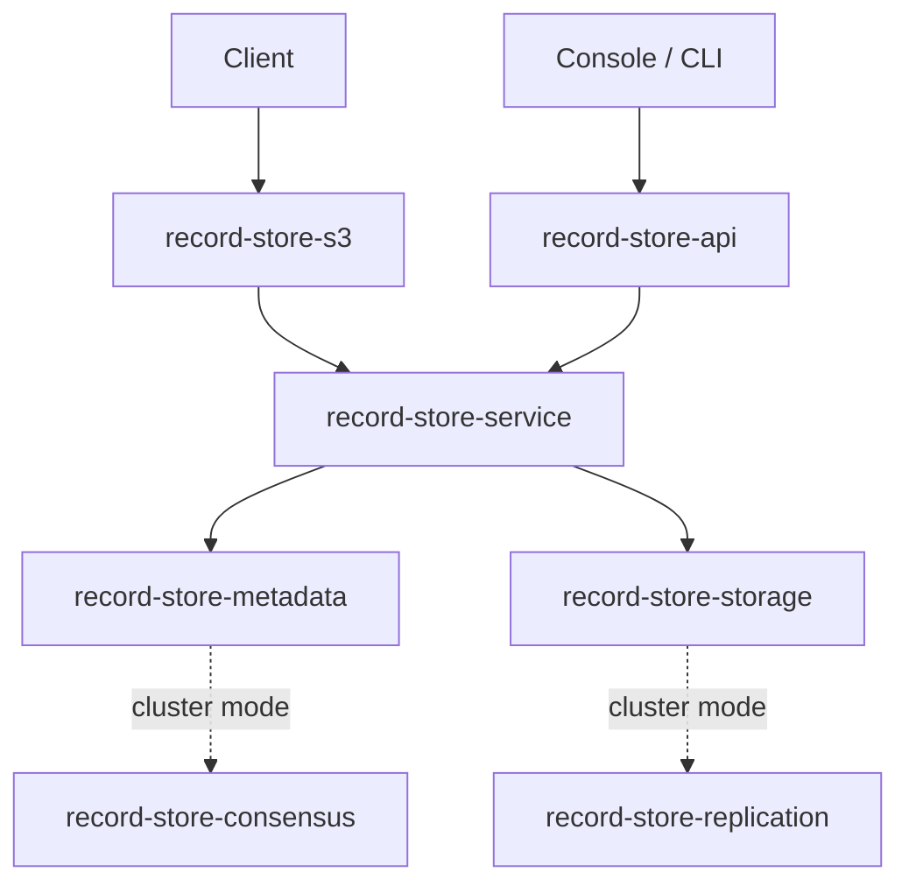

# Repository Structure

```text
record-store/
├── apps/
│   ├── record-store-cli/       the record-store binary
│   └── record-store-server/    the record-store-server binary and startup wiring
├── crates/                     19 library crates
├── console/                    Next.js web console
├── deploy/docker/              Dockerfiles and Compose files
├── docs/                       this documentation
├── tests/
│   ├── compatibility/          real-SDK tests against a live server
│   └── rust-audit.sh           dependency audit with its documented exception
└── Cargo.toml                  workspace manifest
```

## Crates

Roughly bottom-up:

| Crate | Responsibility |
| --- | --- |
| `record-store-core` | Domain types, identifiers, validation. Depends on nothing else here |
| `record-store-config` | Loading, environment overlay, secret redaction, validation |
| `record-store-observability` | Tracing setup |
| `record-store-storage` | Local payload storage, chunked encryption, layout |
| `record-store-metadata` | Catalog: buckets, objects, versions, multipart, quotas |
| `record-store-auth` | Service accounts, credentials, policies, evaluation |
| `record-store-audit` | Durable append-only audit trail |
| `record-store-events` | Storage events and signed webhook delivery |
| `record-store-sharing` | Share and embed capabilities |
| `record-store-lifecycle` | Bounded, restart-safe expiration worker |
| `record-store-service` | Object and bucket services over storage and metadata |
| `record-store-s3` | S3 protocol adapter: SigV4, routing, XML |
| `record-store-api` | Management API, sharing routes, metrics |
| `record-store-protocol` | Wire types shared between nodes |
| `record-store-rpc` | Internal gRPC transport, TLS, peer verification |
| `record-store-consensus` | Raft-backed replicated metadata |
| `record-store-cluster` | Topology, placement, health, replica catalog |
| `record-store-replication` | Coordinator, movement, repair, rebalance, status |
| `record-store-erasure` | **Not wired in.** Replication is the durability model |

`record-store-erasure` exists in the workspace and nothing depends on it. Erasure
coding is not implemented.

## Data flow



In standalone mode, metadata and storage are local. In cluster mode the same interfaces
are backed by consensus and replication — the service layer above does not change.

## Where to make a change

| Change | Crate |
| --- | --- |
| A new S3 operation | `record-store-s3`, plus `record-store-service` if it needs new behaviour |
| A new management route | `record-store-api` |
| A new configuration setting | `record-store-config` — sections, partial, environment, validate |
| A new CLI command | `apps/record-store-cli` |
| Policy actions or evaluation | `record-store-auth` |
| Placement or repair | `record-store-cluster`, `record-store-replication` |
| Console UI | `console/` |

Adding a configuration setting touches four files in `record-store-config`: the section
struct and its default, the partial struct used for TOML, the environment overlay, and
validation. Missing one produces a setting that silently does nothing.

## Tests live beside the code

Unit tests are `#[cfg(test)] mod tests` in the same file as what they test. Integration
tests that need a running binary are under `apps/*/tests/`.

Test fixtures shared within a crate go in a `test_support` module.

See [Testing](testing.md).

## Console

```text
console/
├── app/          Next.js routes
├── components/   shared UI
├── features/     per-area code: access, audit, buckets, cluster, events,
│                 integrity, objects, overview, sharing, system, webhooks
├── hooks/
├── lib/
├── e2e/          Playwright
└── test/
```

The console is a **client of the management API**, never a second source of truth. It
holds no state the server does not, and it is a separate image so a headless deployment
carries no frontend.

## Deployment files

| File | Purpose |
| --- | --- |
| `Dockerfile` | The server image |
| `Dockerfile.console` | The console image |
| `compose.yml` | Standalone, development |
| `compose.console.yml` | Standalone plus console, development |
| `compose.cluster.yml` | Three storage nodes, a control node, and the console |
| `docker-compose.yaml` | Coolify — `expose` plus Coolify magic variables |

The last is the one Coolify uses. See [Coolify](../deployment/coolify.md).

## Workspace settings

```toml
[workspace.lints.rust]
unsafe_code = "forbid"

[workspace.lints.clippy]
dbg_macro = "deny"
todo = "deny"
unimplemented = "deny"
```

`forbid` cannot be overridden in a crate. Anything that would need `unsafe` needs a
different approach.

Denying `todo!` and `unimplemented!` means a partial implementation cannot be merged
behind a placeholder — either it works, or the code path does not exist.
