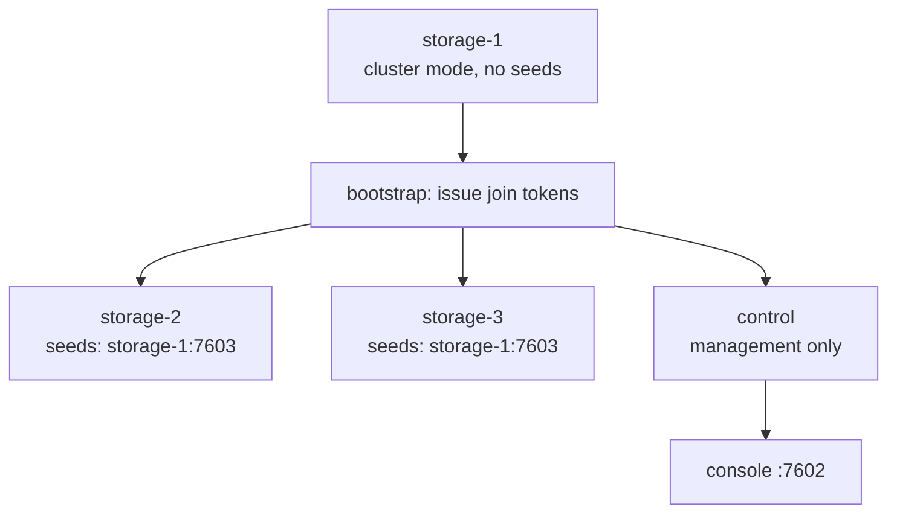

# Docker Compose

Four Compose files ship in `deploy/docker/`:

| File | What it runs | Image |
| --- | --- | --- |
| `compose.ghcr.yml` | Standalone plus the web console | Published |
| `compose.yml` | Standalone Record Store | Built from source |
| `compose.console.yml` | Standalone plus the web console | Built from source |
| `compose.cluster.yml` | Three storage nodes, a control node, and the console | Built from source |

The three source-building files are development configurations. Every credential
in them is a `change-me` placeholder that exists so `docker compose up` works with
no setup. **Override every one before running anything real.**

`compose.ghcr.yml` is the one to deploy. It pulls the
[published images](container-images.md), builds nothing, and refuses to start
until every secret is set:

```bash
RECORD_STORE_VERSION=0.1.1 \
  docker compose --env-file .env -f deploy/docker/compose.ghcr.yml up -d
```

## Standalone

```bash
cd deploy/docker
docker compose -f compose.yml up -d
```

Published ports: `7600` (S3) and `7601` (management). Data lives in the
`record-store-data` named volume.

### Overriding the credentials

Create `deploy/docker/.env`:

```bash
RECORD_STORE_ROOT_ACCESS_KEY=<your-access-key>
RECORD_STORE_ROOT_SECRET_KEY=<your-secret-key>
RECORD_STORE_CREDENTIAL_MASTER_KEY=<your-master-key>
RECORD_STORE_MANAGEMENT_SYSTEM_TOKEN=<your-system-token>
RECORD_STORE_MANAGEMENT_STORAGE_TOKEN=<your-storage-token>
RECORD_STORE_MANAGEMENT_AUDITOR_TOKEN=<your-auditor-token>
RECORD_STORE_METRICS_SCRAPE_TOKEN=<your-metrics-token>
```

Generate them:

```bash
openssl rand -base64 48
```

The three management tokens must be distinct, and the metrics token must differ from
all of them. Add `.env` to `.gitignore`.

For production also restrict the management port to loopback:

```yaml
ports:
  - "7600:7600"
  - "127.0.0.1:7601:7601"
```

## With the console

```bash
docker compose -f compose.console.yml up -d
```

This adds a `console` service on `7602`. Two things about it are worth understanding:

- `RECORD_STORE_API_URL` is `http://record-store:7601` — the **Compose network name**.
  The console server calls the management API; the browser never does. The management
  port does not need to be reachable from the browser at all.
- `RECORD_STORE_CONSOLE_SECURE_COOKIES` defaults to `false` here because local
  development is plain HTTP on loopback. **Set it to `true` behind TLS** so the
  session cookie is marked `Secure`.

The console waits for the server's healthcheck before starting.

Open <http://localhost:7602> and sign in with a management token.

## Local cluster

```bash
docker compose -f compose.cluster.yml up -d
```

Five services: `storage-1`, `storage-2`, `storage-3`, `control`, and `console`, plus a
one-shot `bootstrap` job.



How it works:

1. `storage-1` starts in cluster mode with **no seeds**, so it initializes a new
   cluster.
2. `bootstrap` waits for it to become healthy, then issues one join token per
   remaining node and writes them to a shared volume.
3. Each other node reads its token into `RECORD_STORE_CLUSTER_JOIN_TOKEN` and starts.
4. `control` joins in `control` mode: it serves the management API and holds no
   replicas.
5. `console` points at `control`, not at a storage node.

Each node advertises a distinct `RECORD_STORE_CLUSTER_FAILURE_DOMAIN`
(`region=local,zone=zN,rack=rN`), which is what lets placement spread replicas.

Published: `7600` from `storage-1`, `7601` from `control`, `7602` from `console`.

Check it:

```bash
docker compose -f compose.cluster.yml exec \
  -e RECORD_STORE_MANAGEMENT_TOKEN=<your-system-token> \
  storage-1 record-store cluster status --endpoint http://127.0.0.1:7601
```

!!! note "Reachability is only observable on the leader"
    A member's `reachable` flag means *the leader currently has replication contact
    with it*, and only the leader tracks that. Ask a follower — `control` is one — and
    unobserved peers come back as `null`, with `healthy_members` also `null`, rather
    than as failures.

    That is not a gap in the answer. Raft cannot hold a leader without a majority, so a
    member that can see a leader knows a quorum exists, and reports the cluster
    writable on that basis.

    Query whichever node `status.leader` names when you want the per-peer detail.

!!! warning "This is not a production cluster"
    Every node is on one machine sharing one disk and one kernel. It demonstrates the
    topology and lets you exercise the operations; it provides no real fault
    tolerance. See [Creating a Cluster](../cluster/creating-a-cluster.md).

## Running commands

```bash
docker compose -f compose.yml exec \
  -e RECORD_STORE_MANAGEMENT_TOKEN=<your-system-token> \
  record-store \
  record-store bucket list --endpoint http://127.0.0.1:7601
```

The `-e` is required — `exec` starts a fresh process that does not inherit the
service's environment.

## Logs and shutdown

```bash
docker compose -f compose.yml logs -f record-store
docker compose -f compose.yml down
```

`down` keeps named volumes. `down -v` deletes them, and with them all your data.

## Moving toward production

- Override every credential.
- Bind `7601` to loopback; never publish `7603`.
- Put a TLS terminator in front of `7600` and `7602` — see
  [Reverse Proxy and TLS](reverse-proxy.md).
- Set `RECORD_STORE_CONSOLE_SECURE_COOKIES=true`.
- Set `RECORD_STORE_SHARING_EMBED_BASE_URL` and `RECORD_STORE_SHARING_SHARE_BASE_URL`
  to the public hostnames.
- Replace the named volume with storage you back up — see
  [Persistent Storage](persistent-storage.md).
- Work through the [Production Checklist](production-checklist.md).
