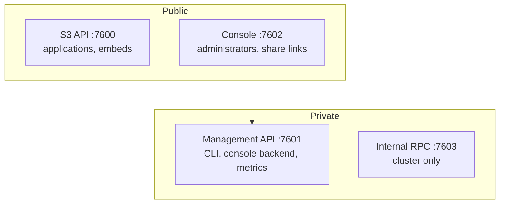

# Deployment

Running Record Store somewhere real.

-   **[Container Images](container-images.md)** — the published images, tags, and digest pinning
-   **[Docker](docker.md)** — the image, its defaults, and running a container
-   **[Docker Compose](docker-compose.md)** — standalone, with the console, and a local cluster
-   **[Coolify](coolify.md)** — end-to-end on a Coolify server
-   **[Reverse Proxy and TLS](reverse-proxy.md)** — what to expose and what to keep private
-   **[Persistent Storage](persistent-storage.md)** — the data directory and its requirements
-   **[Production Checklist](production-checklist.md)** — before you take traffic
-   **[Upgrading](upgrading.md)** — moving to a new version safely
-   **[Verifying a Release](verifying-releases.md)** — provenance, SBOMs, and checksums

## The shape of a deployment

The single most important deployment decision: **7600 and 7602 may face the
internet; 7601 and 7603 must not.** The management API is unrestricted
administrative access, and internal RPC is cluster traffic. See
[Ports](../reference/ports.md).

## Choosing a mode

| | Use when | Trade-off |
| --- | --- | --- |
| **Standalone** | One machine is enough | Simple. No node redundancy — durability is your disk and your backups |
| **Cluster** | You need node redundancy | Three or more nodes, and the operational weight that comes with them |

Standalone is a first-class deployment, not a starter tier. A small installation
should not pay for consensus and replication it does not need.

See [Deployment Modes](../concepts/deployment-modes.md).

## Before you start

Have these ready:

- A data directory on durable storage, backed up
- Root credentials, a credential master key, and a management system token
- A plan for TLS in front of the public ports
- Somewhere to keep the master key that is not the data directory

The master key cannot be rotated. Losing it means losing every stored credential and,
if encryption is enabled, every object. Back it up first, not later.
