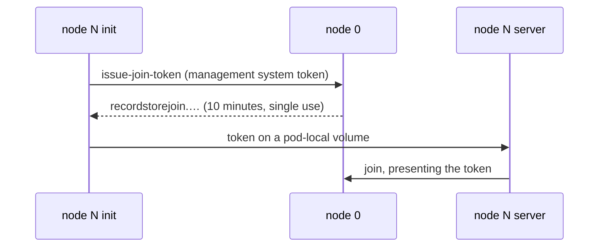

# Kubernetes

Record Store publishes a Helm chart with every release. It runs the server as a
StatefulSet, the console as a Deployment, and keeps the management API inside
the cluster.

```bash
helm install record-store \
  oci://ghcr.io/openelementslabs/charts/record-store --version 0.1.3 \
  --namespace record-store --create-namespace \
  --set auth.rootAccessKey=admin \
  --set auth.rootSecretKey="$(openssl rand -hex 24)" \
  --set auth.credentialMasterKey="$(openssl rand -hex 32)" \
  --set auth.managementSystemToken="$(openssl rand -hex 32)"
```

That is a single standalone node. Read on before using it for anything you
intend to keep.

## What the chart creates

| Resource | Why |
| --- | --- |
| StatefulSet | Each node's identity is durable — consensus membership and the replicas a node holds are tied to the address it advertises |
| Headless Service | Gives every pod a stable DNS name for peer traffic |
| Service (S3) | Port 7600, the endpoint clients talk to |
| Service (management) | Port 7601, `ClusterIP` only |
| Deployment + Service (console) | Port 7602, stateless and interchangeable |
| Secret | Credentials, annotated `helm.sh/resource-policy: keep` |
| ConfigMap | `record-store.toml` |

The management API is never given a `LoadBalancer` or `NodePort` by this chart,
and CI asserts that it stays `ClusterIP`. It is unrestricted administrative
access. Reach it deliberately:

```bash
kubectl -n record-store port-forward svc/record-store-api 7601:7601
```

## Credentials

For a trial, passing credentials through `--set` is fine. For anything
long-lived it is not: Helm records values in the release history. Create the
Secret yourself instead.

```bash
kubectl -n record-store create secret generic record-store-auth \
  --from-literal=root-access-key=admin \
  --from-literal=root-secret-key="$(openssl rand -hex 24)" \
  --from-literal=credential-master-key="$(openssl rand -hex 32)" \
  --from-literal=management-system-token="$(openssl rand -hex 32)"
```

```yaml
auth:
  existingSecret: record-store-auth
```

The chart-managed Secret is kept when the release is uninstalled, so
reinstalling does not orphan credentials already encrypted with the master key.

!!! warning "Back up the credential master key outside the cluster"

    It cannot be rotated. Losing it makes every stored service-account
    credential unreadable, and with encryption enabled, every object.

## Running a cluster

`replicaCount: 1` is standalone: no consensus, no replication, one owner of the
data. Three or more turns on cluster mode.

```yaml
replicaCount: 3
persistence:
  size: 500Gi
  storageClassName: fast-ssd
podDisruptionBudget:
  enabled: true
  maxUnavailable: 1
```

Two replicas is the one size that buys nothing: a two-node cluster cannot form a
majority after losing either node.

### How nodes find each other

Every pod in a StatefulSet shares one spec, but node 0 has to behave
differently: it starts with no seeds, which is what tells Record Store to
initialize a new cluster rather than join one. The chart makes that distinction
at startup from the pod's ordinal.

Each node advertises its own stable DNS name from the headless service, because
the address it binds is not the address its peers can reach.

A join token is not a value you choose. The running cluster issues it, records
it in its own replicated state, and expires it — so it cannot be put in a Secret
in advance. Instead each new node runs an init container that asks node 0 for
one, using the management system token, and hands it to the server:



This happens once per node. A node that has already joined re-attaches from its
own state on restart and never presents a token again, so the init container
exits immediately in that case. Nothing has to be rotated, and no long-lived
join credential exists anywhere.

Because node 0 issues the tokens, it must be running before a new node can
join — which `OrderedReady` already guarantees when scaling up.

!!! danger "Node 0's volume is what the cluster is bootstrapped from"

    If node 0's PersistentVolumeClaim is deleted while the other nodes keep
    running, node 0 restarts with empty state, sees no seeds, and initializes a
    *second* cluster. Treat that volume as you would any other irreplaceable
    one. Restoring it from backup is the recovery path; deleting it is not.

Spread nodes across failure domains, or a rack outage takes the majority with
it:

```yaml
topologySpreadConstraints:
  - maxSkew: 1
    topologyKey: topology.kubernetes.io/zone
    whenUnsatisfiable: DoNotSchedule
    labelSelector:
      matchLabels:
        app.kubernetes.io/name: record-store
        app.kubernetes.io/component: server
```

## Storage

`persistence.enabled: false` puts objects in an `emptyDir` — useful for a trial,
never for anything else.

The data directory wants a local or network-attached block volume with real
`fsync` semantics. See [Persistent Storage](persistent-storage.md) for what the
storage layer expects. The chart cannot grow a StatefulSet's volumes for you: to
expand, your StorageClass must allow volume expansion, and you edit the PVCs
directly.

## Configuration

`values.yaml` carries `configuration` as raw TOML, rendered into the ConfigMap
unchanged. It is the same file documented in
[Configuration](../administration/configuration.md), so nothing about
configuring Record Store changes because it is running in Kubernetes.

```yaml
configuration: |
  [storage]
  data_directory = "/var/lib/record-store"
  encryption_enabled = true

  [observability]
  log_filter = "record_store=info"
  json = true
```

Listener addresses, the advertised peer address and every credential are set by
the chart through the environment and override the file. Changing
`configuration` restarts the pods, because the ConfigMap's checksum is part of
the pod template.

## Exposing it

The S3 endpoint is the only server port meant to be published.

```yaml
ingress:
  s3:
    enabled: true
    className: nginx
    host: storage.example.com
    annotations:
      nginx.ingress.kubernetes.io/proxy-body-size: "0"
    tls:
      - secretName: storage-tls
        hosts: [storage.example.com]
  console:
    enabled: true
    className: nginx
    host: record-store.example.com
    tls:
      - secretName: console-tls
        hosts: [record-store.example.com]
```

Objects are not small, and every ingress controller has a default body limit
lower than the uploads you intend to allow. Raise it explicitly — the annotation
above is the nginx spelling.

See [Reverse Proxy and TLS](reverse-proxy.md) for what belongs in front of which
port.

## Metrics

```yaml
auth:
  metricsScrapeToken: "..."   # or the metrics-scrape-token key in your Secret
metrics:
  podAnnotations:
    enabled: true
```

The endpoint stays closed while no token is set. See
[Metrics](../administration/metrics.md).

## Upgrading

```bash
helm upgrade record-store \
  oci://ghcr.io/openelementslabs/charts/record-store --version 0.1.4 \
  --namespace record-store --reuse-values
```

The StatefulSet rolls one pod at a time, highest ordinal first, waiting for each
to pass its readiness probe. Read [Upgrading](upgrading.md) for what a version
change can mean for stored data.

## Air-gapped installs

The chart is attached to each release as a tarball, so it can be installed
without reaching a registry:

```bash
helm install record-store ./record-store-0.1.3.tgz --values my-values.yaml
```

You will also need to mirror `ghcr.io/openelementslabs/record-store` and
`…/record-store-console` into your own registry and point `image.repository` and
`console.image.repository` at it.
