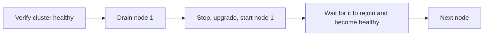

# Upgrading

## Before you start

1. **Read the release notes** for every version between the one you run and the one
   you want. They are generated from
   [CHANGELOG.md](https://github.com/OpenElementsLabs/record-store/blob/main/CHANGELOG.md)
   and list anything that requires action on your part.
2. **Take a backup and verify it.** An upgrade is the moment a backup earns its keep.

```bash
record-store server backup-metadata --output /backups/pre-upgrade-2026-08-29
```

3. **Rehearse on a non-production deployment** with a copy of real metadata.

## Standalone

```bash
# 1. Back up
record-store server backup-metadata --output /backups/pre-upgrade

# 2. Stop, allowing the full drain window
docker stop --time 40 record-store

# 3. Pull the new image
docker pull ghcr.io/openelementslabs/record-store:0.1.1

# 4. Validate configuration against the new version before starting it
docker run --rm \
  --env-file /etc/record-store/env \
  ghcr.io/openelementslabs/record-store:0.1.1 \
  record-store server check-config

# 5. Start
docker run -d --name record-store ... ghcr.io/openelementslabs/record-store:0.1.1

# 6. Verify
record-store status --endpoint http://127.0.0.1:7601
```

Step 4 is the cheap one that catches the expensive problem: a setting that was valid
in the old version and is not in the new one.

## Metadata schema

Metadata carries a schema version. On startup the server checks it against what the
binary supports.

- **Newer binary, older data** — the server migrates or opens it as needed.
- **Older binary, newer data** — refused. Downgrading past a schema change is not
  supported.

The same rule applies to restores: `restore-metadata` rejects a backup whose schema
version is newer than the binary's.

This is why the backup comes first. Rolling back the binary does not roll back the
metadata.

## Choosing what to upgrade to

Upgrade to an exact version, never to `latest`: you need to know what you are
moving to, and to be able to move back to what you had. See
[Container Images](container-images.md).

```bash
# Confirm what you are about to run before you run it
docker run --rm --entrypoint record-store \
  ghcr.io/openelementslabs/record-store:0.1.1 --version
```

Check the digest and the checksums before you deploy — see
[Verifying a Release](verifying-releases.md).

## Rolling back

If the new version fails to start or misbehaves:

```bash
# 1. Stop the new version
docker stop --time 40 record-store

# 2. Start the previous image against the same data directory
docker run -d --name record-store ... ghcr.io/openelementslabs/record-store:<previous>
```

If the metadata schema changed, the old binary will refuse to open it. Then the path
is a full restore:

```bash
# Move the current metadata aside rather than deleting it
mv /var/lib/record-store/metadata /var/lib/record-store/metadata.failed

record-store server restore-metadata /backups/pre-upgrade
```

Restore requires an empty `metadata/` directory. Object payloads under `objects/` are
untouched by any of this.

## Cluster

Upgrade one node at a time. Never restart two at once — a three-node cluster loses
quorum when two are down.



```bash
# 1. Confirm the cluster is healthy before touching anything
record-store cluster status --endpoint https://management.example.com

# 2. Drain the node
record-store node drain <node-id> --endpoint https://management.example.com

# 3. Stop, upgrade, and start it

# 4. Wait for it to rejoin
record-store node inspect <node-id> --endpoint https://management.example.com

# 5. Only then move to the next node
```

Between nodes, wait for `record-store cluster status` to report the cluster healthy
again. Under-replication during the window is expected; it should resolve on its own.

Upgrade the control node last, so the management API stays available while the storage
nodes move.

See [Node Lifecycle](../cluster/node-lifecycle.md).

## Console

The console is a separate image, `ghcr.io/openelementslabs/record-store-console`,
and can be upgraded independently. It is a client of
the management API, so a version skew between them is survivable — but keep them close
and upgrade the console after the server.

## After the upgrade

```bash
record-store status --endpoint http://127.0.0.1:7601
record-store cluster status --endpoint http://127.0.0.1:7601   # cluster only

# Round-trip a real object
aws --endpoint-url https://storage.example.com s3 cp /tmp/smoke.txt s3://smoke-test/
aws --endpoint-url https://storage.example.com s3 cp s3://smoke-test/smoke.txt -
```

Watch error rates and log volume for a while afterwards. Keep the pre-upgrade backup
until you are confident.
