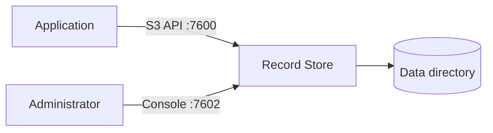

# Introduction

Record Store stores files — objects — and serves them over an S3-compatible HTTP API.
If your application can talk to Amazon S3, it can talk to Record Store.

## What it is for

Record Store is useful when you want object storage that you run yourself:

- application file storage (uploads, exports, generated documents, media)
- storage that must stay on infrastructure you control
- an S3 endpoint for development that behaves like the one in production
- storage for a small team or a single application, without operating a distributed
  system from day one

It is a single Rust binary with an embedded metadata database. There is no external
database, message queue, or object gateway to run alongside it.

## How it is organised

Record Store exposes four listeners. Each has a distinct audience.

| Port | Listener | Who talks to it |
| --- | --- | --- |
| 7600 | S3 API | Applications, AWS SDKs, embed links |
| 7601 | Management API | The console, the CLI, automation |
| 7602 | Web console | Administrators, share-link recipients |
| 7603 | Internal RPC | Other cluster nodes only |

Only 7600 and 7602 are normally reachable from outside your network. See
[Ports](../reference/ports.md) for the full picture and
[Reverse Proxy and TLS](../deployment/reverse-proxy.md) for publishing them.

## Standalone first

A standalone deployment is one process with one copy of your data. It is the default,
it needs no cluster configuration, and it is the right starting point.

A cluster replicates objects across several nodes and keeps metadata consistent with
Raft. It protects against losing a node; it costs you a distributed system to operate.
Start standalone and move to a cluster when you actually need the availability. See
[Deployment Modes](../concepts/deployment-modes.md).

!!! warning "Replication is not backup"
    A cluster protects against hardware failure. It does not protect against a
    mistaken delete, which replicates just as reliably as anything else. Read
    [Backup and Restore](../operations/backup-and-restore.md).

## Next

- [Installation](installation.md) — the supported ways to obtain and run Record Store
- [Quick Start](quick-start.md) — running and storing an object in about five minutes
