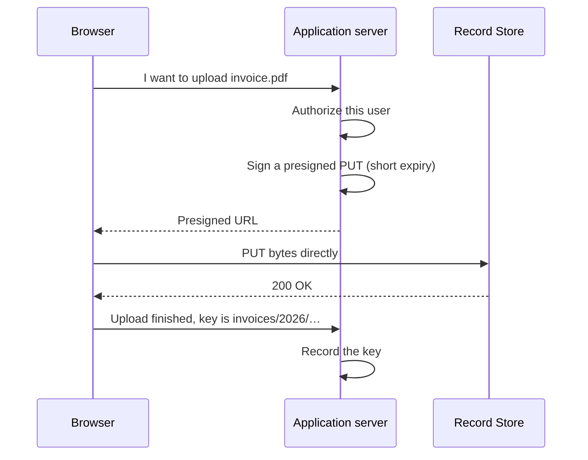
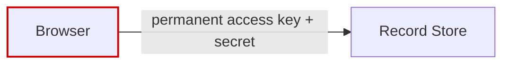

# Application Integration

How an application should talk to Record Store, and the one pattern to avoid.

## Use a service account

Create one service account per application and environment, and attach a policy that
grants only what that application needs.

```text
invoicing-production
invoicing-staging
backup-agent
```

Root credentials are bootstrap credentials, not application credentials. Once your
applications have their own, set `RECORD_STORE_ROOT_S3_ENABLED=false`.

See [Service Accounts](../administration/service-accounts.md) and
[Policies](../administration/policies.md).

## Server-side access

The straightforward pattern. Your application server holds the credential and talks
to Record Store directly.


Right for: generated documents, exports, background jobs, anything the user does not
upload directly.

Cost: every byte passes through your application server.

## Browser uploads

For user uploads, do **not** proxy the bytes through your server, and do not give the
browser a credential. Sign a [presigned URL](presigned-urls.md) server-side and let
the browser upload directly.



Your server stays in control of *who* may upload and *where*, but never carries the
bytes.

Two things must be configured for this to work in a browser:

1. A [CORS rule](#cors) on the bucket allowing your web origin.
2. A short expiry on the presigned URL — minutes, not days.

## Never do this



!!! danger "A browser must never receive a permanent S3 secret key"
    Anything in browser JavaScript is readable by anyone who opens developer tools.
    A leaked secret key is a full credential for everything its policy allows, it does
    not expire, and rotating it means redeploying every client.

    Presigned URLs exist precisely so the browser gets a narrow, expiring capability
    instead.

## Downloads

The same choice applies.

| Approach | Use when |
| --- | --- |
| Proxy through your server | You need per-request authorization logic |
| [Presigned GET](presigned-urls.md) | The user may have the object, and you want the bytes to go direct |
| [Share link](share-links.md) | A person should get a page, and you may need to revoke it |
| [Embed link](embed-links.md) | A website should render the object |

## CORS

Browser access is denied by default. Record Store applies no deployment-wide wildcard;
you configure CORS per bucket.

```bash
aws --endpoint-url https://storage.example.com s3api put-bucket-cors --bucket uploads \
  --cors-configuration '{
    "CORSRules": [{
      "AllowedOrigins": ["https://app.example.com"],
      "AllowedMethods": ["PUT", "GET", "HEAD"],
      "AllowedHeaders": ["content-type", "x-amz-*"],
      "ExposeHeaders": ["ETag", "x-amz-version-id"],
      "MaxAgeSeconds": 3600
    }]
  }'
```

A successful preflight is unauthenticated, but it grants only the origins, methods,
and headers stored on that bucket. The signed request that follows still needs its own
S3 permission or a valid presigned URL.

Record Store never emits `Access-Control-Allow-Credentials`: S3 browser authorization
belongs in the signature, not in ambient cookies.

## Choosing a key layout

Keys are flat strings; prefixes are how you organise them. Two rules matter:

- **Do not put a secret in a key.** Keys appear in logs, listings, and URLs.
- **Avoid keys derived only from user input.** Prefix with something you control
  (a tenant ID, an object UUID) so one user cannot guess or collide with another's.

```text
tenants/<tenant-id>/invoices/2026/03/<uuid>.pdf
```

## Environment configuration

```bash
RECORD_STORE_ENDPOINT=https://storage.example.com
RECORD_STORE_ACCESS_KEY=<service account access key>
RECORD_STORE_SECRET_KEY=<service account secret key>
RECORD_STORE_BUCKET=uploads
```

Every SDK needs `forcePathStyle` (or its equivalent) and a region string of
`us-east-1`. See the [SDK guides](../sdk/index.md).
