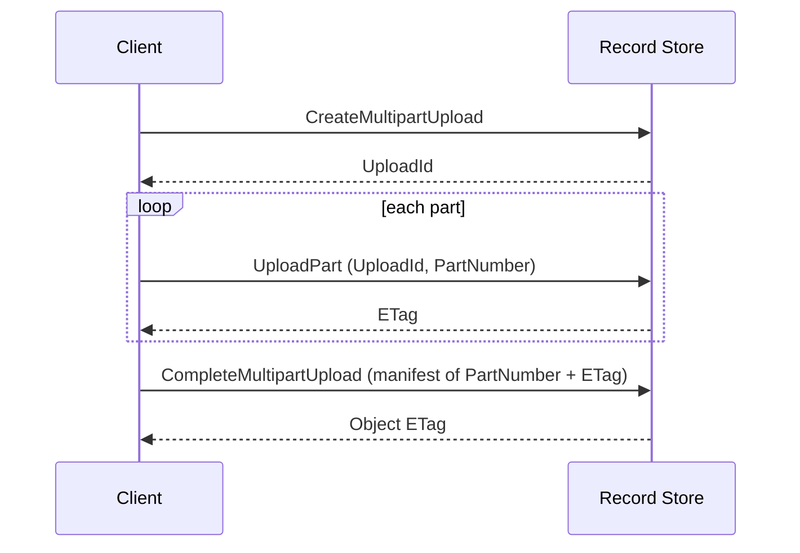

# Multipart Uploads

Multipart splits one object into parts that upload independently and are assembled
server-side. Use it for large objects and unreliable networks.

## Single request versus multipart

| | Single `PUT` | Multipart |
| --- | --- | --- |
| Requests | One | Create, N parts, complete |
| Retry granularity | The whole object | One part |
| Resumable | No | Yes, while the upload lives |
| Parallel | No | Yes |

!!! warning "A single PUT is not resumable"
    If a single-request upload is interrupted, it must be sent again from the first
    byte. Only multipart lets you retry a part. The console uploads objects as one
    streaming `PUT` and says so rather than implying otherwise.

Most SDKs switch to multipart automatically above a threshold — the AWS CLI and
`@aws-sdk/lib-storage` both do. You often do not call these operations directly.

## The lifecycle



### Create

```bash
aws --endpoint-url https://storage.example.com s3api create-multipart-upload \
  --bucket demo --key big.bin
```

Returns an `UploadId` identifying this upload.

### Upload parts

Parts are numbered from 1. Each returns an `ETag` you must keep.

```bash
aws --endpoint-url https://storage.example.com s3api upload-part \
  --bucket demo --key big.bin --upload-id <upload-id> \
  --part-number 1 --body ./part-1
```

Every part except the last must be at least **5 MiB**. A smaller non-final part is
rejected at completion with `EntityTooSmall`. The final part may be any size.

### Complete

```bash
aws --endpoint-url https://storage.example.com s3api complete-multipart-upload \
  --bucket demo --key big.bin --upload-id <upload-id> \
  --multipart-upload '{"Parts":[{"PartNumber":1,"ETag":"..."},{"PartNumber":2,"ETag":"..."}]}'
```

The manifest must be **strictly ascending** by part number. A descending or repeated
number is rejected with `InvalidPartOrder`, because accepting it would silently
assemble bytes in an order the client did not upload.

Each entry's `ETag` must match the part Record Store stored. A mismatch is
`InvalidPart` — the client is describing a part that does not exist.

### Abort

```bash
aws --endpoint-url https://storage.example.com s3api abort-multipart-upload \
  --bucket demo --key big.bin --upload-id <upload-id>
```

Aborting releases the parts and the storage they occupy.

## Inspecting uploads in flight

```bash
aws --endpoint-url https://storage.example.com s3api list-multipart-uploads --bucket demo
aws --endpoint-url https://storage.example.com s3api list-parts \
  --bucket demo --key big.bin --upload-id <upload-id>
```

Both are paginated.

## Cost of abandoned uploads

Parts occupy storage until the upload completes or is aborted, and they count against
the bucket's [quota](../administration/quotas.md). An application that starts uploads
and abandons them leaks space.

List uploads periodically and abort stale ones. Record Store does not expire them on a
timer.

## Crash safety

Completion has a durable "completing" state and startup reconciliation. If the process
dies between beginning a completion and publishing the object, the next startup
resolves it rather than leaving the upload stuck or the object half-visible.

## Presigned part uploads

Parts can be uploaded with [presigned URLs](presigned-urls.md), verified by the same
canonical SigV4 verifier. This is how a browser can upload a large file directly:
your server creates the upload and signs each part URL, the browser `PUT`s the parts,
and your server completes the upload.

!!! note "The management API does not expose presigned part URLs yet"
    You can build this with the S3 API and an SDK on your own server. The console does
    not offer resumable browser uploads for this reason.

## What is not supported

`UploadPartCopy` — creating a part by copying a byte range from an existing object — is
not implemented and returns `NotImplemented`.
