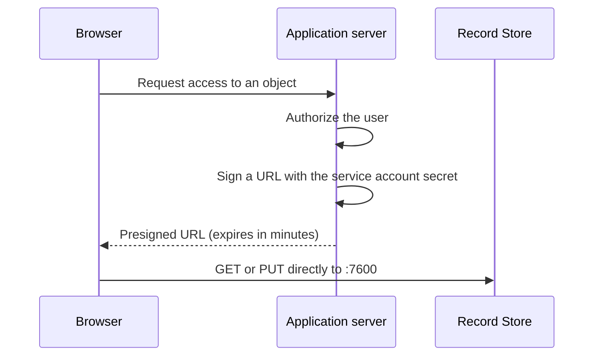

# Presigned URLs

A presigned URL is a normal S3 URL that carries a signature in its query string. It
lets someone perform **one operation on one object** for a limited time, without
holding a credential.

Record Store supports presigned `GET` and presigned `PUT`, including presigned
multipart part uploads.

## How it works



The signing happens entirely in your application with the SDK. No call to Record Store
is involved in creating the URL.

## Creating one

=== "AWS CLI"

    ```bash
    aws --profile record-store --endpoint-url https://storage.example.com \
      s3 presign s3://uploads/report.pdf --expires-in 900
    ```

=== "JavaScript"

    ```ts
    import { GetObjectCommand } from "@aws-sdk/client-s3";
    import { getSignedUrl } from "@aws-sdk/s3-request-presigner";

    const url = await getSignedUrl(
      client,
      new GetObjectCommand({ Bucket: "uploads", Key: "report.pdf" }),
      { expiresIn: 900 },
    );
    ```

=== "Python"

    ```python
    url = s3.generate_presigned_url(
        "get_object",
        Params={"Bucket": "uploads", "Key": "report.pdf"},
        ExpiresIn=900,
    )
    ```

For an upload, sign `PutObjectCommand` / `put_object` instead.

## Security

!!! warning "A presigned URL is a bearer capability"
    Anyone holding it can perform that operation until it expires. It cannot be
    revoked. Treat it like a password with a timer.

Practical consequences:

- **Keep expiry short.** Minutes for uploads, minutes to an hour for downloads.
  Record Store enforces a fixed ceiling of 7 days; it is not configurable.
- **Do not log them.** The signature is in the query string, so a URL in an access log
  is a live capability.
- **Do not put them in email or chat** if the object is sensitive — those are archived.
  Use a [share link](share-links.md), which is revocable.
- **Sign server-side only.** Signing in the browser means the browser has the secret,
  which defeats the purpose.

### Scope

A presigned URL is bound to the method, the bucket, the key, and the expiry it was
signed with. A presigned `GET` cannot be turned into a `PUT`, and a URL for one object
cannot reach another. Record Store verifies all of it with the same canonical SigV4
verifier used for header-authenticated requests.

The signature is also bound to the credential that signed it. Disabling or rotating
that service account's credential invalidates URLs it signed — the one way to withdraw
a presigned URL early.

## Presigned URLs versus share links

| | Presigned URL | [Share link](share-links.md) |
| --- | --- | --- |
| Created by | Any credential holder, offline | An administrator, via console or API |
| Revocable | Only by disabling the credential | Yes, immediately |
| Expiry | Required, up to 7 days | Optional, policy-bounded |
| Password | No | Optional |
| Delivered by | S3 API `:7600` | Console `:7602` |
| Audience | A program | A person |

## Browser uploads

For a browser to `PUT` to a presigned URL, the bucket needs a
[CORS rule](application-integration.md#cors) permitting your origin and the `PUT`
method. Without it the browser blocks the request before it is sent, which looks like
a network failure rather than a permissions error.

See the [Next.js guide](../sdk/nextjs.md) for a complete worked example.
