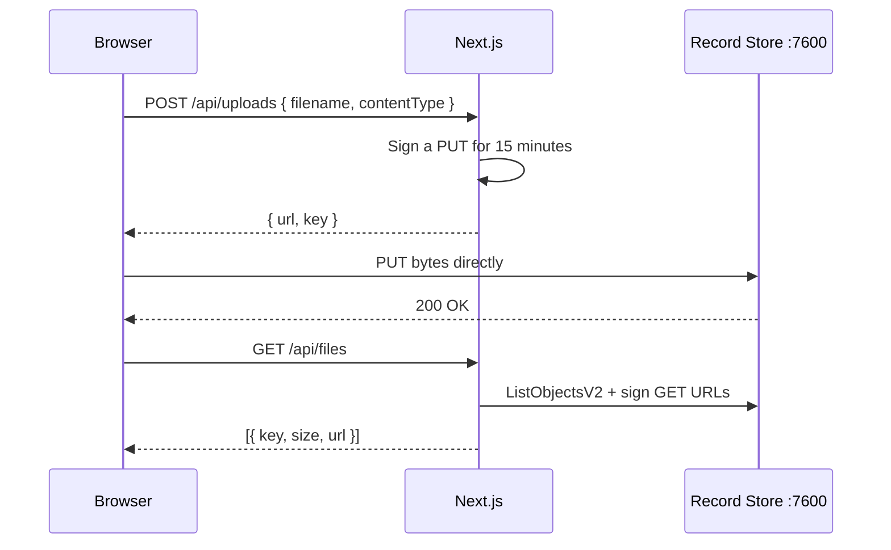

# Tutorial: File Upload App

Build a working Next.js file-upload application against Record Store, end to end:
running server, scoped service account, direct browser uploads, and a listing page.

Roughly 30 minutes. The reference for each piece is
[Next.js](../sdk/nextjs.md); this walks the whole thing.

## What you will build



The browser talks to Record Store directly for bytes. The secret key never leaves the
server.

## 1. Start Record Store

```bash
cd deploy/docker
docker compose -f compose.yml up -d
```

Override the placeholder credentials first — create `deploy/docker/.env`:

```bash
RECORD_STORE_ROOT_ACCESS_KEY=<your-access-key>
RECORD_STORE_ROOT_SECRET_KEY=<your-secret-key>
RECORD_STORE_CREDENTIAL_MASTER_KEY=<your-master-key>
RECORD_STORE_MANAGEMENT_SYSTEM_TOKEN=<your-system-token>
```

```bash
openssl rand -base64 48
```

Confirm it is up:

```bash
docker compose -f compose.yml exec \
  -e RECORD_STORE_MANAGEMENT_TOKEN=<your-system-token> \
  record-store record-store status --endpoint http://127.0.0.1:7601
```

## 2. Create the bucket

```bash
export RECORD_STORE_MANAGEMENT_TOKEN=<your-system-token>
export ENDPOINT=http://127.0.0.1:7601

record-store bucket create uploads --endpoint $ENDPOINT
```

## 3. Create a scoped service account

Do not use the root credential. Create an account and give it exactly what the app
needs:

```bash
record-store service-account create upload-app --endpoint $ENDPOINT
```

Save the access key and secret — **the secret is shown once**.

```json title="upload-app-policy.json"
{
  "name": "upload-app",
  "description": "Read and write objects in the uploads bucket",
  "statements": [
    {
      "effect": "allow",
      "actions": ["s3:ListBucket"],
      "resources": ["bucket:uploads"]
    },
    {
      "effect": "allow",
      "actions": ["s3:GetObject", "s3:PutObject", "s3:DeleteObject"],
      "resources": ["bucket:uploads/*"]
    }
  ]
}
```

Note the two separate resources. `bucket:uploads` covers the bucket for listing;
`bucket:uploads/*` covers its objects. One without the other does not work.

```bash
record-store policy create ./upload-app-policy.json --endpoint $ENDPOINT
record-store policy attach <policy-id> <account-id> --endpoint $ENDPOINT
```

No `s3:ManageBucket` — the app can use the bucket and cannot delete it.

## 4. Configure CORS

The browser uploads directly, so the bucket must allow that origin:

```json title="cors.json"
{
  "CORSRules": [
    {
      "AllowedOrigins": ["http://localhost:3000"],
      "AllowedMethods": ["GET", "PUT", "HEAD"],
      "AllowedHeaders": ["*"],
      "ExposeHeaders": ["ETag"],
      "MaxAgeSeconds": 3000
    }
  ]
}
```

```bash
AWS_ACCESS_KEY_ID=<service account access key> \
AWS_SECRET_ACCESS_KEY=<service account secret key> \
aws --endpoint-url http://127.0.0.1:7600 \
  s3api put-bucket-cors --bucket uploads --cors-configuration file://cors.json
```

Origins are exact: scheme, host, and port all count. Add your production origin when
you deploy.

## 5. Create the app

```bash
npx create-next-app@latest upload-app --typescript --app --eslint
cd upload-app
npm install @aws-sdk/client-s3 @aws-sdk/s3-request-presigner server-only
```

```bash title=".env.local"
RECORD_STORE_ENDPOINT=http://127.0.0.1:7600
RECORD_STORE_BUCKET=uploads
RECORD_STORE_ACCESS_KEY=<service account access key>
RECORD_STORE_SECRET_KEY=<service account secret key>
```

!!! danger "No `NEXT_PUBLIC_` prefix"
    Anything prefixed `NEXT_PUBLIC_` is inlined into the browser bundle. The secret key
    must never be.

Add `.env.local` to `.gitignore`.

## 6. The server-side client

```ts title="lib/record-store.ts"
import "server-only";
import { S3Client } from "@aws-sdk/client-s3";

export const bucket = process.env.RECORD_STORE_BUCKET!;

export const recordStore = new S3Client({
  endpoint: process.env.RECORD_STORE_ENDPOINT!,
  region: "us-east-1",
  forcePathStyle: true,
  credentials: {
    accessKeyId: process.env.RECORD_STORE_ACCESS_KEY!,
    secretAccessKey: process.env.RECORD_STORE_SECRET_KEY!,
  },
});
```

`import "server-only"` turns an accidental client import into a build error rather than
a leaked secret.

`forcePathStyle: true` is required.

## 7. The signing route

```ts title="app/api/uploads/route.ts"
import { NextResponse } from "next/server";
import { PutObjectCommand } from "@aws-sdk/client-s3";
import { getSignedUrl } from "@aws-sdk/s3-request-presigner";
import { randomUUID } from "node:crypto";
import { bucket, recordStore } from "@/lib/record-store";

const MAX_BYTES = 50 * 1024 * 1024;

export async function POST(request: Request) {
  const { filename, contentType, size } = await request.json();

  if (typeof filename !== "string" || typeof contentType !== "string") {
    return NextResponse.json({ error: "invalid request" }, { status: 400 });
  }
  if (typeof size === "number" && size > MAX_BYTES) {
    return NextResponse.json({ error: "file too large" }, { status: 413 });
  }

  // The server chooses the key. A client-supplied key lets a caller overwrite
  // anything it can name.
  const extension = filename.includes(".") ? filename.split(".").pop() : "bin";
  const key = `${new Date().toISOString().slice(0, 10)}/${randomUUID()}.${extension}`;

  const url = await getSignedUrl(
    recordStore,
    new PutObjectCommand({ Bucket: bucket, Key: key, ContentType: contentType }),
    { expiresIn: 900 },
  );

  return NextResponse.json({ url, key });
}
```

Three decisions worth keeping:

- **The server chooses the key.** Accepting one from the client lets a caller overwrite
  any object it can name.
- **The expiry is short.** 15 minutes is plenty for an upload.
- **`ContentType` is signed**, so the browser must send exactly that value.

In a real application, authenticate the user here and namespace the key by their ID.

## 8. The listing route

```ts title="app/api/files/route.ts"
import { NextResponse } from "next/server";
import { GetObjectCommand, ListObjectsV2Command } from "@aws-sdk/client-s3";
import { getSignedUrl } from "@aws-sdk/s3-request-presigner";
import { bucket, recordStore } from "@/lib/record-store";

export async function GET() {
  const listing = await recordStore.send(
    new ListObjectsV2Command({ Bucket: bucket, MaxKeys: 100 }),
  );

  const files = await Promise.all(
    (listing.Contents ?? []).map(async (object) => ({
      key: object.Key!,
      size: object.Size ?? 0,
      url: await getSignedUrl(
        recordStore,
        new GetObjectCommand({ Bucket: bucket, Key: object.Key! }),
        { expiresIn: 300 },
      ),
    })),
  );

  return NextResponse.json({ files });
}
```

Download URLs are signed per request with a short expiry, so a listing page does not
hand out long-lived links.

## 9. The upload component

```tsx title="app/upload-form.tsx"
"use client";

import { useState } from "react";

export function UploadForm({ onUploaded }: { onUploaded: () => void }) {
  const [busy, setBusy] = useState(false);
  const [error, setError] = useState<string | null>(null);

  async function upload(file: File) {
    setBusy(true);
    setError(null);
    try {
      const response = await fetch("/api/uploads", {
        method: "POST",
        headers: { "content-type": "application/json" },
        body: JSON.stringify({
          filename: file.name,
          contentType: file.type || "application/octet-stream",
          size: file.size,
        }),
      });
      if (!response.ok) throw new Error((await response.json()).error ?? "failed");

      const { url } = await response.json();

      const put = await fetch(url, {
        method: "PUT",
        body: file,
        headers: { "content-type": file.type || "application/octet-stream" },
      });
      if (!put.ok) throw new Error(`upload failed: ${put.status}`);

      onUploaded();
    } catch (cause) {
      setError(cause instanceof Error ? cause.message : "upload failed");
    } finally {
      setBusy(false);
    }
  }

  return (
    <div>
      <input
        type="file"
        disabled={busy}
        onChange={(event) => {
          const file = event.target.files?.[0];
          if (file) void upload(file);
        }}
      />
      {busy && <p>Uploading…</p>}
      {error && <p role="alert">{error}</p>}
    </div>
  );
}
```

The `content-type` on the `PUT` must match what was signed, or the signature fails.

## 10. The page

```tsx title="app/page.tsx"
"use client";

import { useCallback, useEffect, useState } from "react";
import { UploadForm } from "./upload-form";

type FileEntry = { key: string; size: number; url: string };

export default function Home() {
  const [files, setFiles] = useState<FileEntry[]>([]);

  const refresh = useCallback(async () => {
    const response = await fetch("/api/files");
    const { files } = await response.json();
    setFiles(files);
  }, []);

  useEffect(() => {
    void refresh();
  }, [refresh]);

  return (
    <main style={{ padding: "2rem", fontFamily: "system-ui" }}>
      <h1>Uploads</h1>
      <UploadForm onUploaded={refresh} />
      <ul>
        {files.map((file) => (
          <li key={file.key}>
            <a href={file.url}>{file.key}</a> — {(file.size / 1024).toFixed(1)} KB
          </li>
        ))}
      </ul>
    </main>
  );
}
```

## 11. Run it

```bash
npm run dev
```

Open <http://localhost:3000>, upload a file, and it appears in the list.

Confirm from the other side:

```bash
AWS_ACCESS_KEY_ID=<service account access key> \
AWS_SECRET_ACCESS_KEY=<service account secret key> \
aws --endpoint-url http://127.0.0.1:7600 s3 ls s3://uploads/ --recursive
```

## Troubleshooting

| Symptom | Cause |
| --- | --- |
| CORS error in the browser console | The origin is not in the bucket's CORS rules — exact match, including port |
| `403` on the `PUT` | The URL expired, or `content-type` differs from what was signed |
| `403` on listing | The policy is missing `bucket:uploads` for `s3:ListBucket` |
| `NotImplemented` | Set `AWS_REQUEST_CHECKSUM_CALCULATION=WHEN_REQUIRED` |
| Uploads work, listing is empty | The listing route is querying a different bucket |

More in [Upload Problems](../troubleshooting/uploads.md).

## Before this goes to production

- [ ] **Authenticate users** in both routes, and namespace keys by user ID
- [ ] Validate content type against an allowlist, not just size
- [ ] Add the production origin to the bucket's CORS rules
- [ ] Serve everything over TLS; set `RECORD_STORE_SHARING_EMBED_BASE_URL`
- [ ] Use [multipart uploads](multipart-uploads.md) for files above ~100 MB
- [ ] Consider [versioning](../concepts/versioning.md) on the bucket
- [ ] Add a [lifecycle rule](../administration/lifecycle-rules.md) if uploads are
      temporary
- [ ] Set a [quota](../administration/quotas.md) on the bucket
- [ ] Never expose the management API to the browser

The first item is the one that matters most: as written, anyone who can reach the app
can upload and list everything.

## Where to go next

- [Share Links](share-links.md) — hand a file to someone who has no account
- [Embed Links](embed-links.md) — put an image or video in another site
- [Events and Webhooks](../administration/events-and-webhooks.md) — react to uploads
  server-side
