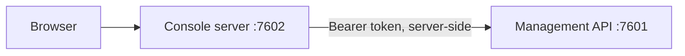

# Web Console

The console is an administrative interface for Record Store. It is a client of the
management API on 7601 and is entirely optional — Record Store stays fully operable
through the [CLI](cli.md) and the API alone.

## How it is wired

The browser talks only to the console's own origin. The console server attaches the
management credential and forwards the request, so:

- the credential lives in an HTTP-only cookie the page cannot read
- no CORS configuration is needed for administration
- the browser never reaches storage, metadata, consensus, or port 7603

Public [share pages](share-links.md) are served by the same application but authorize
differently: that path attaches no credential at all, because the token in the URL is
the authorization.

## Signing in

Go to the console's address and sign in with a management role token — the value of
`RECORD_STORE_MANAGEMENT_SYSTEM_TOKEN`, `RECORD_STORE_MANAGEMENT_STORAGE_TOKEN`, or
`RECORD_STORE_MANAGEMENT_AUDITOR_TOKEN`.

The role you sign in with decides what the console offers. An auditor token gets a
read-only console. See [Authorization](../security/authorization.md).

## What is there

| Screen | What it does |
| --- | --- |
| Overview | Deployment status, capacity, and recent activity |
| Buckets | Create, inspect, and delete buckets; versioning and quota |
| Objects | Browse by prefix, upload, download, preview, manage versions |
| Service accounts | Create accounts, rotate credentials, enable and disable |
| Policies | Create policies and attach them to accounts |
| Audit | Query the durable security audit trail |
| Events | Storage event history |
| Webhooks | Configure endpoints and inspect delivery attempts |
| Integrity | Verify checksums for an object or a whole bucket |
| Metrics | The same numbers Prometheus scrapes, rendered |
| System | Deployment mode and capabilities |

In cluster mode the console additionally shows **Nodes**, **Consensus**,
**Durability**, and **Rebalance**. In standalone mode those screens are absent —
the console discovers the mode from `GET /api/v1/system/info` and adapts.

## Object browsing

Keys are flat, but the browser presents them as folders using prefixes and delimiters.
Navigating into `reports/` lists what is directly beneath it plus the next level of
pseudo-folders. See [Buckets and Objects](../concepts/buckets-and-objects.md).

## Uploads

The browser sends an object as one streaming `PUT`. The `File` handle is the request
body, so bytes travel from disk to the network without passing through the page's
heap — object size is not bounded by browser memory.

!!! warning "Console uploads are not resumable"
    An interrupted upload fails and must be sent again from the first byte. Resumable
    browser uploads need presigned multipart part URLs, which the management API does
    not expose yet. For large or unreliable uploads, use the
    [AWS CLI](aws-cli.md) or an [SDK](../sdk/index.md).

## Preview

The console renders images, video, audio, PDFs, text, and JSON inline, and offers
everything else as a download. The declared media type is corroborated against the
object's leading bytes before anything is rendered. See
[Object Preview](object-preview.md).

## Configuration

| Variable | Purpose |
| --- | --- |
| `RECORD_STORE_API_URL` | Management API base URL. Default `http://127.0.0.1:7601`. |
| `RECORD_STORE_CONSOLE_SECURE_COOKIES` | Force the session cookie's `Secure` flag. Defaults to on in production. |
| `PORT` | Console listener. Default `7602`. |

`RECORD_STORE_API_URL` is read on the server at runtime, so one image works in any
deployment and no localhost assumption is compiled into the bundle.

!!! danger "Do not expose the management API to reach the console"
    The console reaches 7601 over your private network. Publishing 7601 to the
    internet so a browser can reach it defeats the design — the browser is not
    supposed to talk to it at all.
