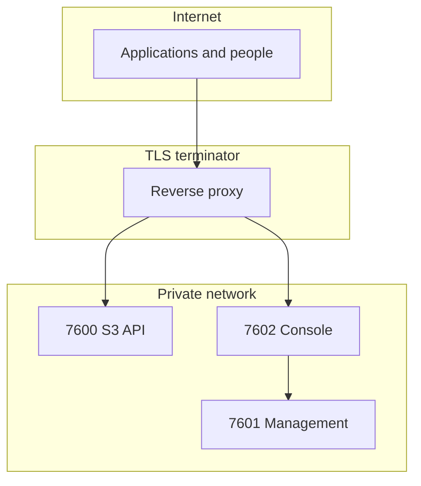

# Ports

| Port | Serves | Public | Setting |
| --- | --- | --- | --- |
| **7600** | S3 API, and embed links at `/e/<token>` | Yes, behind TLS | `server.s3_bind` |
| **7601** | Management API, `/metrics`, share delivery at `/s/<token>` | **No** | `server.api_bind` |
| **7602** | Web console, and share links at `/s/<token>` | Yes, behind TLS | Console `PORT` |

## What to expose



**7601 is unrestricted administrative access.** A management token on that port can
create credentials, change policies, and read every bucket. It must not be reachable
from the internet.

## 7600 — S3 API

The data plane. Applications sign requests here with SigV4.

It also serves embed links at `/e/<token>` — an embed delivers object bytes into
somebody else's page, so it belongs on the storage endpoint rather than the console.

```bash
RECORD_STORE_S3_BIND=0.0.0.0:7600
RECORD_STORE_SHARING_EMBED_BASE_URL=https://storage.example.com
```

## 7601 — Management API

Administration, plus:

| Path | Auth |
| --- | --- |
| `/api/v1/*` | Management bearer token |
| `/health`, `/ready` | None |
| `/metrics` | Metrics scrape token |
| `/s/<token>` | The capability token itself |

```bash
RECORD_STORE_API_BIND=127.0.0.1:7601
```

Binding it to loopback is the simplest way to keep it private when the console runs on
the same host. In Compose or Kubernetes, use the internal network name and publish
nothing.

To reach it remotely, tunnel:

```bash
ssh -L 7601:127.0.0.1:7601 admin@your-server
```

## 7602 — Web console

A separate process. It calls the management API server-side; the browser never does.

```bash
PORT=7602
RECORD_STORE_API_URL=http://record-store:7601
RECORD_STORE_CONSOLE_SECURE_COOKIES=true
RECORD_STORE_SHARING_SHARE_BASE_URL=https://console.example.com
```

Share links resolve on the console because a share is a page a person opens.

**7602 is reserved.** Configuration validation refuses to let any Record Store listener
bind it.

## Validation

Enforced at startup:

- The server listeners must be different from each other.
- None may use port 7602.
- No port may be zero.

## Firewall

```bash
# Public
ufw allow 443/tcp

# Never
# ufw allow 7601/tcp
```

Verify:

```bash
curl -sS --max-time 5 https://storage.example.com:7601/health || echo "closed, as intended"
```
