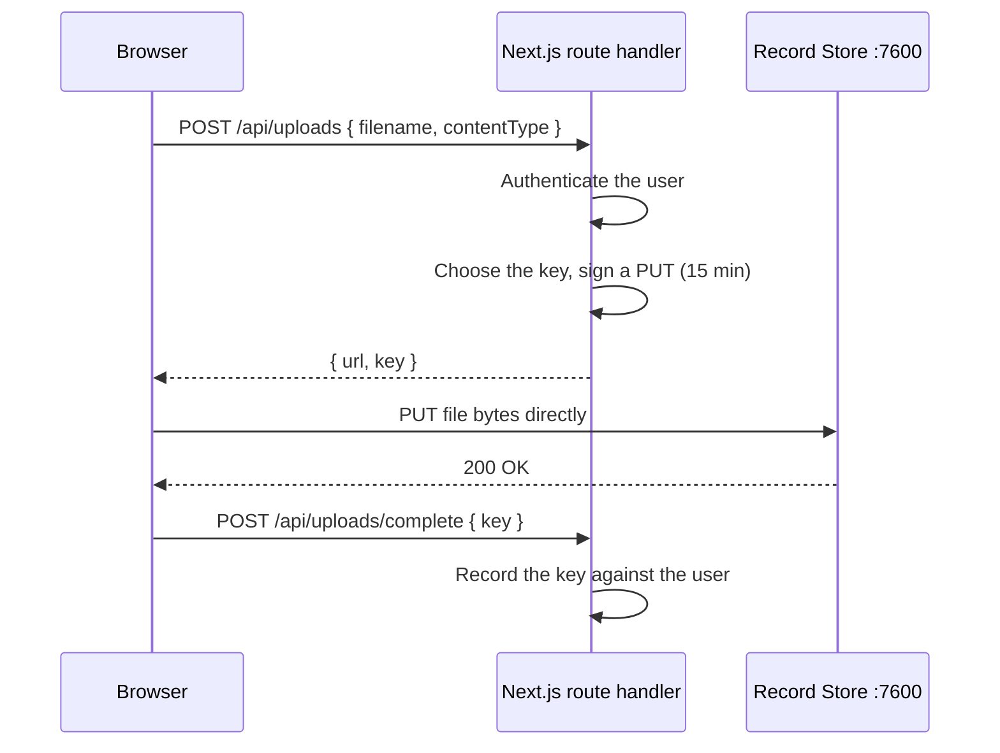

# Next.js

The pattern below keeps the Record Store secret on the server while letting the browser
upload bytes directly.

```bash
npm install @aws-sdk/client-s3 @aws-sdk/s3-request-presigner
```

## Architecture



!!! danger "Never ship the secret to the browser"
    Environment variables prefixed `NEXT_PUBLIC_` are inlined into the client bundle.
    The Record Store secret key must never be one of them.

## Client

```ts title="lib/record-store.ts"
import "server-only";
import { S3Client } from "@aws-sdk/client-s3";

export const recordStore = new S3Client({
  endpoint: process.env.RECORD_STORE_ENDPOINT!,
  region: "us-east-1",
  forcePathStyle: true,
  credentials: {
    accessKeyId: process.env.RECORD_STORE_ACCESS_KEY!,
    secretAccessKey: process.env.RECORD_STORE_SECRET_KEY!,
  },
});
```

The `server-only` import turns an accidental client import into a build error.

## Signing route

```ts title="app/api/uploads/route.ts"
import { NextResponse } from "next/server";
import { PutObjectCommand } from "@aws-sdk/client-s3";
import { getSignedUrl } from "@aws-sdk/s3-request-presigner";
import { randomUUID } from "node:crypto";
import { recordStore } from "@/lib/record-store";
import { requireUser } from "@/lib/auth";

const ALLOWED = new Set(["image/png", "image/jpeg", "application/pdf"]);

export async function POST(request: Request) {
  const user = await requireUser();                       // (1)!
  const { contentType } = await request.json();

  if (!ALLOWED.has(contentType)) {                        // (2)!
    return NextResponse.json({ error: "unsupported type" }, { status: 400 });
  }

  const key = `users/${user.id}/${randomUUID()}`;         // (3)!

  const url = await getSignedUrl(
    recordStore,
    new PutObjectCommand({
      Bucket: process.env.RECORD_STORE_BUCKET!,
      Key: key,
      ContentType: contentType,                           // (4)!
    }),
    { expiresIn: 900 },                                   // (5)!
  );

  return NextResponse.json({ url, key });
}
```

1. Authorize first. This endpoint mints upload capability — leaving it open lets
   anyone write to your bucket.
2. Validate the declared type. It is also worth checking size server-side after upload.
3. Derive the key from something you control. A key built only from user input lets
   one user guess or overwrite another's.
4. Signing `ContentType` binds it: the browser must send the same value.
5. Short expiry. A presigned URL cannot be revoked, only allowed to expire.

## Browser upload

```tsx title="components/upload.tsx"
"use client";

export async function uploadFile(file: File) {
  const response = await fetch("/api/uploads", {
    method: "POST",
    headers: { "content-type": "application/json" },
    body: JSON.stringify({ contentType: file.type }),
  });
  const { url, key } = await response.json();

  const upload = await fetch(url, {
    method: "PUT",
    headers: { "content-type": file.type }, // (1)!
    body: file,                             // (2)!
  });
  if (!upload.ok) throw new Error(`upload failed: ${upload.status}`);

  return key;
}
```

1. Must match the `ContentType` that was signed, or the signature will not verify.
2. Passing the `File` directly streams it; the bytes never sit in the page's heap.

## CORS

The browser `PUT` goes to Record Store's origin, so the bucket needs a CORS rule.
Without it the request is blocked before it is sent, which looks like a network error.

```bash
aws --endpoint-url https://storage.example.com s3api put-bucket-cors --bucket uploads \
  --cors-configuration '{
    "CORSRules": [{
      "AllowedOrigins": ["https://app.example.com"],
      "AllowedMethods": ["PUT", "GET", "HEAD"],
      "AllowedHeaders": ["content-type"],
      "ExposeHeaders": ["ETag"],
      "MaxAgeSeconds": 3600
    }]
  }'
```

## Serving files back

=== "Presigned GET"

    For a private object the user is entitled to:

    ```ts
    const url = await getSignedUrl(
      recordStore,
      new GetObjectCommand({ Bucket, Key: key }),
      { expiresIn: 300 },
    );
    ```

    Do not cache these in a CDN — they expire, and they are capabilities.

=== "Stream through the route"

    When you need per-request authorization:

    ```ts
    const object = await recordStore.send(new GetObjectCommand({ Bucket, Key: key }));
    return new Response(object.Body as ReadableStream, {
      headers: {
        "content-type": object.ContentType ?? "application/octet-stream",
        "content-disposition": `attachment; filename="${filename}"`,
      },
    });
    ```

=== "Embed link"

    For a public image on a marketing page, an
    [embed link](../guides/embed-links.md) avoids signing anything per request and can
    be revoked later.

## Large files

For files large enough that a single `PUT` is unreliable, you need multipart with
presigned part URLs, created and completed on your server. The management API does not
expose presigned part URLs, so build this with the S3 API directly. See
[Multipart Uploads](../guides/multipart-uploads.md).

## Environment

```bash title=".env.local"
RECORD_STORE_ENDPOINT=https://storage.example.com
RECORD_STORE_ACCESS_KEY=<service account access key>
RECORD_STORE_SECRET_KEY=<service account secret key>
RECORD_STORE_BUCKET=uploads
```

None of these are `NEXT_PUBLIC_`, so none reach the browser.
