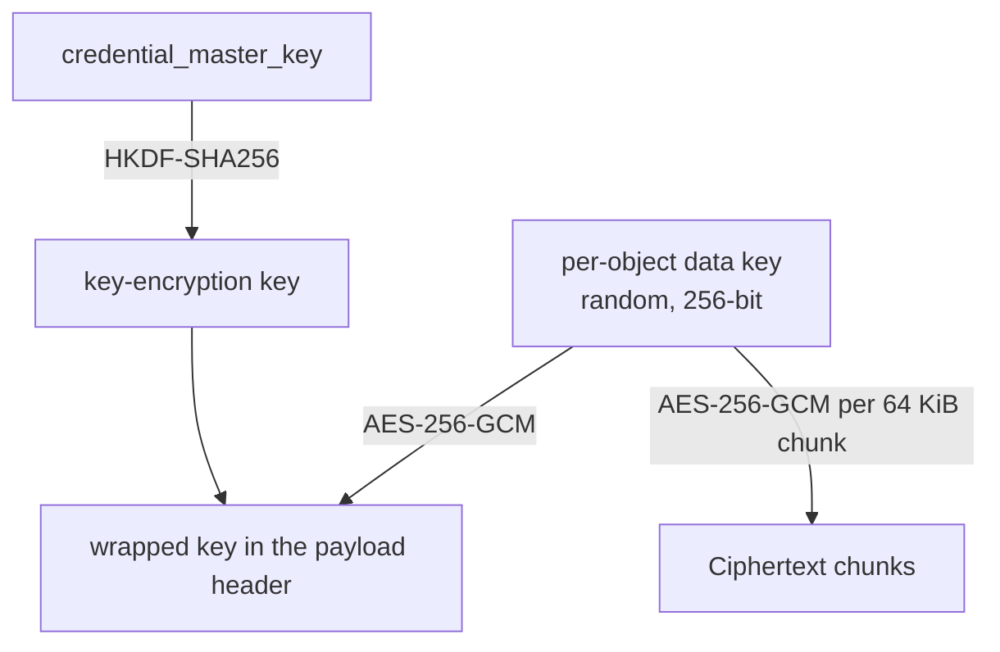

# Encryption

## In transit

Record Store serves plain HTTP. TLS is terminated by a reverse proxy in front of it —
see [Reverse Proxy and TLS](../deployment/reverse-proxy.md).

Internal cluster traffic has its own TLS configuration — see
[Internal TLS](internal-tls.md).

## At rest

Object payloads can be encrypted on disk. It is off by default.

```bash
RECORD_STORE_STORAGE_ENCRYPTION_ENABLED=true
RECORD_STORE_CREDENTIAL_MASTER_KEY=<your-master-key>
```

The master key is required — enabling encryption without it fails validation at
startup.

### Scheme

Envelope encryption with chunked AES-256-GCM, identified as
`AES-256-GCM-ENVELOPE-CHUNKED`.



- Each object gets its own randomly generated 256-bit data key.
- The data key is wrapped with a key-encryption key derived from the master key by
  HKDF-SHA256, and stored in the payload's 124-byte header.
- The payload is encrypted in **64 KiB chunks**, each with its own authentication tag
  and its chunk index bound into the additional authenticated data.
- The header is itself authenticated: it is the AAD for the key wrap, so a tampered
  header fails to unwrap.

Chunking is what preserves range reads. A request for bytes 1,000,000–1,001,000 decrypts
the chunks covering that span, not the whole object.

Per-object data keys mean compromising one object's key compromises one object.

### What is and is not encrypted

| | Encrypted at rest |
| --- | --- |
| Object payloads | Yes, when enabled |
| Object keys, sizes, checksums, custom metadata | No |
| Bucket names and structure | No |
| Service-account secrets | **Always** — independently of this setting |
| Webhook signing secrets | **Always** |
| Share and embed capability secrets | **Always** |
| Audit events | No |

Credential, webhook, and capability secrets are sealed under keys derived from the
master key with their own HKDF contexts, regardless of `encryption_enabled`. That
setting governs object payloads only.

Object keys are not encrypted. If your key names are themselves sensitive — customer
names, case numbers — that is visible to anyone with filesystem access. Encode
sensitive identifiers rather than putting them in the key.

### Enabling it later

Turning encryption on affects **newly committed payloads only**. Existing objects stay
in plaintext, and both formats are readable side by side — the payload header says
which is which.

To encrypt existing data, rewrite it:

```bash
aws --endpoint-url https://storage.example.com s3 cp \
  s3://uploads/key s3://uploads/key --metadata-directive REPLACE
```

There is no bulk re-encryption command.

### Turning it off

New payloads are written in plaintext. Previously encrypted objects remain readable as
long as the master key is unchanged.

## The credential master key

```bash
RECORD_STORE_CREDENTIAL_MASTER_KEY=<your-master-key>
```

32–1024 visible ASCII characters.

```bash
openssl rand -base64 48
```

!!! danger "It cannot be rotated"
    The master key seals:

    - every service-account credential
    - every webhook signing secret
    - every share and embed capability secret
    - every per-object data key, when encryption is on

    Replacing it makes all of that permanently unreadable. There is no re-wrap
    operation and no recovery path.

    Generate it once, back it up **separately from the data directory**, and treat it
    as permanent for the life of the deployment.

Storing the key alongside the data it protects defeats the purpose: one stolen backup
would then be a complete compromise. Keep it in a secret manager.

In a cluster, every node needs the byte-identical key. Nodes with different master keys
cannot read each other's sealed state.

## What encryption at rest protects against

| Threat | Protected |
| --- | --- |
| Stolen disk or backup tape | **Yes** — payloads are unreadable without the master key |
| Decommissioned hardware not wiped | **Yes** |
| Filesystem access on a running server | **No** — the process holds the key in memory |
| A compromised Record Store process | **No** |
| An attacker with valid credentials | **No** — they are served plaintext, as intended |

Encryption at rest is protection for data that leaves your control on physical media.
It is not access control. Access control is [authorization](authorization.md).

## Verifying

```bash
record-store verify object uploads photo.jpg \
  --endpoint https://management.example.com
```

This reads the payload, decrypting if necessary, and checks it against the stored
checksum. A failure means the bytes on disk no longer match what was written.

Every chunk carries its own GCM authentication tag, so tampering with encrypted data is
detected on read rather than silently returned.

See [Integrity Verification](../operations/integrity-verification.md).
