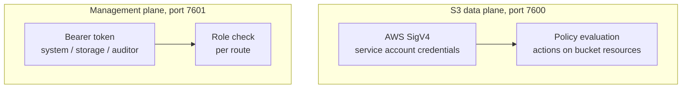

# Security

-   **[Authentication](authentication.md)** — proving who you are
-   **[Authorization](authorization.md)** — what you are allowed to do
-   **[Encryption](encryption.md)** — at rest and in transit
-   **[Internal TLS](internal-tls.md)** — securing cluster traffic
-   **[Sharing Security](sharing-security.md)** — share and embed links
-   **[Security Checklist](checklist.md)** — the short version

## Two independent planes

They do not overlap. A management token cannot read an object; an S3 credential cannot
change configuration. That separation is the point: the credential in an application's
config is not administrative access, and the token in an operator's shell is not a
data credential.

Two further credentials stand outside both:

- The **metrics scrape token**, accepted only by `/metrics` and nowhere else.
- **Capability tokens** in share and embed URLs, which authorize one object and nothing
  more.

## Design decisions worth knowing

**Secrets are never returned twice.** Service-account secrets and webhook signing
secrets are shown once at creation and stored sealed. There is no "show me the key
again" endpoint, because such an endpoint turns read access into credential access.

**Secrets never reach a log.** Secret-typed configuration renders as `<redacted>`, and
a parse failure names the variable without printing its value.

**Default deny.** A request with no matching policy statement is refused. There is no
implicit access.

**Explicit deny wins.** One matching `deny` overrides any number of `allow` statements.

**The audit trail is separate from logs.** Log files rotate away; the audit store is
durable and append-only. See [Audit Log](../administration/audit-log.md).

## Reporting a vulnerability

Report security issues privately through the repository's security contact rather than
in a public issue.
