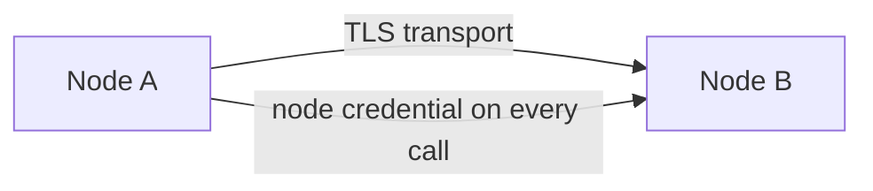

# Internal TLS

Internal RPC (port 7603) carries object bytes, credentials, and metadata between
cluster nodes. Plaintext is for single-host development only.

## Two independent layers



**Every** internal call carries a node credential — an identity issued when the node
joined, verified against replicated cluster state on each request, along with the
protocol version, cluster identity, and node identity. That is checked before any
cluster work happens, with or without TLS.

TLS adds transport security on top: confidentiality on the wire, and — with mutual TLS
— peer authentication at the transport layer as well.

They are complementary. The node credential proves *who is calling*; TLS protects
*what is sent* and stops anyone who cannot present a certificate from reaching the
handshake at all.

## Settings

```toml
[cluster.tls]
certificate_path = "/etc/record-store/tls/node.crt"
private_key_path = "/etc/record-store/tls/node.key"
peer_ca_path     = "/etc/record-store/tls/ca.crt"
client_ca_path   = "/etc/record-store/tls/ca.crt"
server_name      = "node-1.internal"
```

Or by environment:

```bash
RECORD_STORE_CLUSTER_TLS_CERTIFICATE=/etc/record-store/tls/node.crt
RECORD_STORE_CLUSTER_TLS_PRIVATE_KEY=/etc/record-store/tls/node.key
RECORD_STORE_CLUSTER_TLS_PEER_CA=/etc/record-store/tls/ca.crt
RECORD_STORE_CLUSTER_TLS_CLIENT_CA=/etc/record-store/tls/ca.crt
RECORD_STORE_CLUSTER_TLS_SERVER_NAME=node-1.internal
```

| Setting | Role |
| --- | --- |
| `certificate_path` | PEM chain this node presents to peers |
| `private_key_path` | PEM key for that chain |
| `peer_ca_path` | Authority used to verify the certificates peers present |
| `client_ca_path` | Authority used to **require and verify** peer client certificates |
| `server_name` | Handshake server name, when it differs from the advertised address |

Rules, enforced at startup:

- `certificate_path` and `private_key_path` must be set together.
- `client_ca_path` requires this node to present its own certificate.
- TLS is considered enabled when either `certificate_path` or `peer_ca_path` is set.

## Configurations

### Plaintext

Nothing set. Acceptable only when every node is on one host or on a network you fully
control and trust.

### Server TLS

```toml
[cluster.tls]
certificate_path = "/etc/record-store/tls/node.crt"
private_key_path = "/etc/record-store/tls/node.key"
peer_ca_path     = "/etc/record-store/tls/ca.crt"
```

Traffic is encrypted and each node verifies the peers it connects to. Callers are still
authenticated by the node credential.

### Mutual TLS

```toml
[cluster.tls]
certificate_path = "/etc/record-store/tls/node.crt"
private_key_path = "/etc/record-store/tls/node.key"
peer_ca_path     = "/etc/record-store/tls/ca.crt"
client_ca_path   = "/etc/record-store/tls/ca.crt"
```

Adding `client_ca_path` requires every connecting peer to present a certificate signed
by that authority. A client with no certificate is rejected at the handshake, before
any RPC is processed.

This is the configuration to use when cluster traffic crosses a network you do not
fully control.

## Issuing certificates

Use a certificate authority dedicated to the cluster — not your public web CA. Its only
job is to say "this is a node of this cluster".

Requirements:

- Each node's certificate must be valid for the name peers use to reach it, which is
  its `RECORD_STORE_RPC_ADVERTISE` value.
- Set `server_name` when the advertised address is an IP or otherwise differs from the
  certificate's name.
- All nodes must trust the same authority.

Certificate material is read from disk at startup. Renewing means replacing the files
and restarting the node — one at a time, as with any rolling restart. See
[Node Lifecycle](../cluster/node-lifecycle.md).

## Rolling TLS out to a running cluster

You cannot flip every node at once without an outage. Do it in two passes:

1. **Distribute the CA to every node** and set `peer_ca_path` only. Restart one node at
   a time. Nodes now trust the CA and still speak plaintext.
2. **Add `certificate_path` and `private_key_path`** to each node, one at a time,
   restarting as you go.
3. Optionally, once every node presents a certificate, add `client_ca_path` for mutual
   TLS — again one node at a time.

Adding `client_ca_path` before every peer has a certificate will cut the cluster in
half. It is the last step, not the first.

## Verifying

```bash
record-store cluster status --endpoint https://management.example.com
```

Every node healthy after the rollout means the handshakes are working. A node that
cannot complete a handshake fails to reach its peers and shows as `unreachable`.

Startup errors name the file that could not be read or the contradictory setting —
they do not print key material.

## What this does not cover

Internal TLS secures **cluster traffic only**. The S3 API and the console are separate
listeners with their own TLS terminated at a reverse proxy — see
[Reverse Proxy and TLS](../deployment/reverse-proxy.md).
