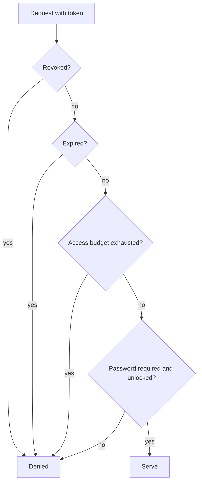

# Sharing Security

Share links and embed links hand out access to an object without an account. The token
in the URL **is** the capability — anyone holding it has whatever it grants.

This page is about the guarantees behind that. For creating and using them, see
[Share Links](../guides/share-links.md) and [Embed Links](../guides/embed-links.md).

## Two capabilities, deliberately not one

| | Share link | Embed link |
| --- | --- | --- |
| Held by | A person | A website |
| Delivered on | The console (`/s/<token>`) | The storage endpoint (`/e/<token>`) |
| Can carry | A password, an access budget | An origin allowlist |
| Response | A page a person opens | Raw object bytes |

They are separate types, not one type with a flag. Every difference above would
otherwise have to become a conditional — and the first forgotten conditional would be a
security decision applied to the wrong capability.

## Tokens

- 32 bytes from the operating system's cryptographic generator, URL-safe base64,
  43 characters.
- Stored as a **lookup digest** plus a sealed copy. The token is not a field on any
  descriptor, so listings, serialization, and log statements are structurally incapable
  of leaking it.
- Shape is validated before the store is consulted, so a probe with a hostile path
  segment never reaches a lookup.

The management API can return a capability's URL through a dedicated `/url` route.
Auditors cannot call it — see [Authorization](authorization.md).

## Every request re-checks

Revocation, expiry, and access budget are checked against durable state on **every**
request, not cached at issue time. A revoked link stops working on the next request.

Order matters, and revocation is checked first and unconditionally:



An operator who revokes a link has made a decision no other field may soften.

## Passwords

Optional on share links.

- Stored as a **salted, memory-hard Argon2 hash**, never as a digest and never as the
  password.
- Failed attempts are rate-limited per share, per client, per minute
  (`sharing.password_attempts_per_minute`, default 10).
- A successful unlock lasts `sharing.unlock_lifetime_hours` (default 12) and is scoped
  to that share.
- Both throttled and failed attempts are written to the audit log as
  `share.password_throttled` and `share.password_failed`.

A password protects against a forwarded link. It does not protect against a recipient
who chooses to pass on both the link and the password.

## Probe limiting

Unknown-token lookups are rate-limited per client
(`sharing.token_probes_per_minute`, default 60). Combined with 256 bits of token
entropy, guessing is not a realistic attack — the limit is there so probing is also not
a cheap way to load the server.

Client identity comes from the first entry of `X-Forwarded-For`, falling back to the
socket address. Set that header at a proxy you control and have it overwrite whatever
the client sent; otherwise every visitor behind the proxy shares one counter.

## Response headers

Both delivery paths set:

| Header | Value |
| --- | --- |
| `X-Content-Type-Options` | `nosniff` |
| `Content-Type` | A canonical safe type, or `application/octet-stream` |
| `Content-Disposition` | `inline` or `attachment` with a sanitised filename |
| `Accept-Ranges` | `bytes`, or `none` when an access budget forbids ranges |

Two decisions worth noting:

- **An attachment is always `application/octet-stream`.** The browser is being asked to
  save bytes, so the safest type is also the correct one.
- **An inline response uses a canonical type from a fixed allowlist**, not whatever the
  object claims. An object whose content type is `text/html` cannot be served inline
  through a capability — that would be stored XSS on your domain.

A share with a strict access budget answers `Accept-Ranges: none` rather than accepting
a range request and quietly serving the whole object.

## Embeds and origins

An embed may carry an allowlist of origins permitted to read it from a browser. An
empty list means unrestricted — the unguessable token is then the whole capability.

The recorded content type is checked at delivery, so an embed whose object is later
replaced with something that must not be served inline stops working rather than
serving it.

Origin refusals are audited as `embed.denied`.

## Version pinning

A capability resolves either to the current version or to one pinned immutable version.
This is recorded at creation and never inferred.

| Mode | Use |
| --- | --- |
| `follow_current` | A logo that should track edits |
| `pinned` | A signed contract that must never change |

Pin anything whose content is the point. A `follow_current` capability to a document
serves whatever that key holds later, which may not be what you shared.

## Deployment-wide ceilings

These bound what any administrator may create. Set them so your most careless
administrator cannot exceed your policy:

```bash
RECORD_STORE_SHARING_SHARES_ENABLED=true
RECORD_STORE_SHARING_EMBEDS_ENABLED=true
RECORD_STORE_SHARING_MAXIMUM_LIFETIME_DAYS=30
RECORD_STORE_SHARING_REQUIRE_EXPIRATION=true
RECORD_STORE_SHARING_REQUIRE_PASSWORD=false
RECORD_STORE_SHARING_MAXIMUM_ACCESS_COUNT=1000
```

`maximum_lifetime_days = 0` means no ceiling. That is an opt-in, not the default — a
capability that never expires is one somebody has to track forever.

These are policy, not enforcement on their own: the capability service re-checks each
one, and the public delivery routes re-check revocation and expiry per request.

If a deployment does not need sharing, turn it off entirely.

## Auditing

| | Recorded |
| --- | --- |
| Creation, update, revocation, deletion | Audit log, with the management role as principal |
| Refusals | Audit log as `share.denied`, `embed.denied`, `share.password_failed`, `share.password_throttled`, with a reason |
| **Successful** public accesses | [Metrics](../administration/metrics.md) counters, not the audit log |

The last row is deliberate. A shared video answers thousands of range requests; writing
an immutable audit row for each would let an anonymous visitor fill the security trail.
That would be the vulnerability, not the protection.

```bash
record-store audit \
  --principal capability:public \
  --endpoint https://management.example.com
```

## Operational advice

- Set an expiry on everything. `require_expiration` makes that a deployment rule.
- Pin the version when the content is the point.
- Use an access budget for one-time deliveries.
- Restrict embed origins when you know which site will use them.
- Review active links periodically — `record_store_share_links_active` and
  `record_store_embeds_active` tell you how many exist.
- Revoke rather than wait for expiry when a link has served its purpose.
